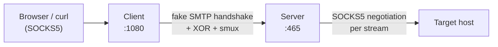

# 🔒 Proxy-Over-SMTP

**Proxy-Over-SMTP** is a SOCKS5 proxy tunnel that disguises its traffic as an SMTP session and XOR-obfuscates the payload to confuse Deep Packet Inspection (DPI). This project is inspired by [smtp-tunnel-proxy](https://github.com/x011/smtp-tunnel-proxy).

A **client** exposes a local SOCKS5 port. A **server** answers a fake SMTP handshake, then carries every proxied connection as a multiplexed stream inside a single TCP connection.

---

## ⚠️ Breaking Changes

The command line changed completely. Old command lines no longer work: Cobra rejects single-dash long flags such as `-secret` and `-mode`. Update every service unit, Docker command and script before upgrading.

| Before | Now |
|---|---|
| `-mode server` | `server` subcommand |
| `-mode client` | `client` subcommand |
| `-server ADDR` | `server --listen ADDR` |
| `-client ADDR` | `client --listen ADDR` |
| `-remote ADDR` | `client --remote ADDR` |
| `-secret X` (default `THIS_IS_YOUR_SECRET_WORD`) | `--secret X` or env `PROXY_OVER_SMTP_SECRET`. **Required, no default.** |
| `-log-file PATH` (default `./proxy-over-smtp.log`) | `--log-file PATH`. **Off by default**, logs go to stdout only |
| `AUDIT: ...` plain text lines | `slog` structured lines (`--log-format text` or `json`) |
| `-allow-private` | `server --allow-private` |

**Client and server must be upgraded together.** The tunnel now uses smux protocol v2 (per-stream flow control), so old and new binaries do not interoperate.

---

## ✨ Why Proxy-Over-SMTP?

*   **🎭 SMTP Disguise:** Every connection opens with a plausible `220` / `EHLO` / `DATA` exchange before tunneling starts.
*   **🧩 XOR Obfuscation:** Payload is XORed with a rolling key derived from your shared secret.
*   **⚡ Multiplexed Tunnel:** One TCP connection carries many streams via [smux](https://github.com/xtaci/smux), with keepalive, for low latency and fewer handshakes.
*   **🧦 Standard SOCKS5:** Works with browsers, `curl`, and anything that speaks SOCKS5 (IPv4, IPv6 and domain targets).
*   **🛑 Graceful Shutdown:** Active connections drain on `SIGINT` / `SIGTERM` (5s limit).
*   **📝 Structured Logs:** `slog` events on stdout (text or JSON), one `tunnel opened` line per proxied connection. Optional log file.
*   **🌱 Twelve-Factor:** All settings from flags or `PROXY_OVER_SMTP_*` env vars. The secret has no default.
*   **📦 Static Binaries:** `CGO_ENABLED=0` builds for Linux, macOS, and Windows, plus a Docker image.

---

## 🏗️ Architecture at a Glance



See [docs/ARCHITECTURE.md](docs/ARCHITECTURE.md) and [docs/WORKFLOWS.md](docs/WORKFLOWS.md) for details.

---

## 🚀 Getting Started

### 📋 Prerequisites

*   **Go** (1.25+)
*   **Make** (For Builds)
*   **GoReleaser** *(Optional, for mass binaries)*
*   **Docker** *(Optional, for containers)*

---

## 🛠️ Deployment

### 🐳 **Using Container**

1.  **Install Docker** following the [official guide](https://docs.docker.com/desktop/).
2.  **Run the server side:**
    ```sh
    docker run -d \
      -p 465:465 \
      -e PROXY_OVER_SMTP_SECRET="change-me" \
      --name proxy-over-smtp-server \
      --rm dimaskiddo/proxy-over-smtp:latest \
      server --listen 0.0.0.0:465
    ```
3.  **Run the client side:**
    ```sh
    docker run -d \
      -p 1080:1080 \
      -e PROXY_OVER_SMTP_SECRET="change-me" \
      --name proxy-over-smtp-client \
      --rm dimaskiddo/proxy-over-smtp:latest \
      client --listen 0.0.0.0:1080 --remote 192.168.1.100:465
    ```
4.  Point your browser to SOCKS version 5 at `127.0.0.1:1080` (or your client port).

The image entrypoint is `proxy-over-smtp` and the default command is `server`.

### 📦 **Using Pre-Built Binaries**

1.  Download the latest release from the [Releases Page](https://github.com/dimaskiddo/proxy-over-smtp/releases) and extract it.
2.  **Run server and client** (set the secret in the environment so it stays out of `ps` and shell history):

#### 🐧 **Linux / 🍎 macOS**
```sh
chmod 755 proxy-over-smtp
export PROXY_OVER_SMTP_SECRET="change-me"

# Server
./proxy-over-smtp server --listen 0.0.0.0:465

# Client
./proxy-over-smtp client --listen 0.0.0.0:1080 --remote 192.168.1.100:465
```

#### 🪟 **Windows**
*(PowerShell)*
```powershell
$env:PROXY_OVER_SMTP_SECRET = "change-me"

# Server
.\proxy-over-smtp.exe server --listen 0.0.0.0:465

# Client
.\proxy-over-smtp.exe client --listen 0.0.0.0:1080 --remote 192.168.1.100:465
```

### 🏗️ **Build From Source**

```sh
git clone -b master https://github.com/dimaskiddo/proxy-over-smtp.git
cd proxy-over-smtp

make vendor    # Pull vendor packages
make run ARGS="server --secret change-me"   # Run from source
make build     # Build binary for this platform
make release   # (Optional) Mass binaries via GoReleaser, output in dist/
```

---

## 🕹️ Usage

```
proxy-over-smtp <command> [flags]

  server    Run the tunnel server
  client    Run the local SOCKS5 client
  update    Update this binary to the latest GitHub release
  version   Print version information (also --version)
```

Server and client use the same binary and the same secret. Every flag can also be set through an environment variable named `PROXY_OVER_SMTP_` plus the flag name in upper case with `-` as `_`. Precedence: flag, then env, then default.

| Flag | Env | Default | Commands | Purpose |
|---|---|---|---|---|
| `--listen` | `PROXY_OVER_SMTP_LISTEN` | server `0.0.0.0:465`, client `0.0.0.0:1080` | server, client | Listen address |
| `--remote` | `PROXY_OVER_SMTP_REMOTE` | `127.0.0.1:465` | client | Server address the client dials |
| `--secret` | `PROXY_OVER_SMTP_SECRET` | none, **required** | server, client | Shared secret (EHLO token and XOR key). Prefer the env var |
| `--allow-private` | `PROXY_OVER_SMTP_ALLOW_PRIVATE` | `false` | server | Allow loopback, private and link-local targets (blocked by default) |
| `--log-level` | `PROXY_OVER_SMTP_LOG_LEVEL` | `info` | all | `debug`, `info`, `warn`, `error` |
| `--log-format` | `PROXY_OVER_SMTP_LOG_FORMAT` | `text` | all | `text` or `json` |
| `--log-file` | `PROXY_OVER_SMTP_LOG_FILE` | empty | all | Also append logs to this file |
| `--auto-update` | `PROXY_OVER_SMTP_AUTO_UPDATE` | `false` | server, client | Check for new releases, install and restart in place |
| `--update-interval` | `PROXY_OVER_SMTP_UPDATE_INTERVAL` | `24h` | server, client | Auto-update check interval, minimum `1h` |

Quick check through the client:

```sh
curl --socks5-hostname 127.0.0.1:1080 https://example.com
```

### 🔄 Updating

```sh
proxy-over-smtp update --check   # Print current and latest version only
proxy-over-smtp update           # Download, verify and replace this binary
proxy-over-smtp update --force   # Reinstall even if up to date, or from a dev build
```

`update` replaces the binary on disk. Running instances keep the old code until restarted.

With `--auto-update`, a running `server` or `client` checks at start and then every `--update-interval`. On a newer release it swaps the binary, drains connections and re-executes itself with the same arguments (same PID on Unix). Dev builds never auto-update.

Notes:

- Downloads are verified against the release `checksums.txt` (sha256). That proves integrity, not authenticity: releases are not signed.
- Auto-update can leave server and client on different versions. If a release changes the wire protocol, old and new do not interoperate. Update the server first, then clients.
- Docker: the swap lives in the container layer and a container restart reverts it. Pull a new image instead.
- Windows: the re-executed process is a child, so it detaches from a service manager. Prefer manual `update` plus a restart there.
- The binary location must be writable by the running user.

### 📁 Logs

Logs are an event stream on stdout. Redirect or collect them with your process manager (Docker, systemd, Kubernetes). `--log-file` additionally appends to a file.

```
time=2026-10-07T17:10:31.227+07:00 level=INFO msg="tunnel opened" peer=203.0.113.5:56810 target=example.com:443
time=2026-10-07T17:10:32.242+07:00 level=WARN msg="target unreachable" target=10.0.0.1:80 err="dial tcp 10.0.0.1:80: target address not allowed"
```

`--log-format json` emits the same events as JSON lines. Handshake and SOCKS rejections appear at `--log-level debug`. The secret is never logged.

---

## 📚 Documentation

*   [Architecture](docs/ARCHITECTURE.md): module map, handshake, transport stack, design decisions.
*   [Workflows](docs/WORKFLOWS.md): pipeline flows and error recovery.

---

## 🧪 Testing

```sh
go test ./...
```

---

## ✍️ Authors

*   **Dimas Restu Hidayanto** - *Initial Work* - [DimasKiddo](https://github.com/dimaskiddo)

See also the list of [contributors](https://github.com/dimaskiddo/proxy-over-smtp/contributors) who participated in this project.

---

## 🏗️ Dependencies

*   **[Go](https://golang.org/)**
*   **[xtaci/smux](https://github.com/xtaci/smux)** - Stream multiplexer
*   **[spf13/cobra](https://github.com/spf13/cobra)** - CLI framework
*   **[GoReleaser](https://github.com/goreleaser/goreleaser)** - Automated binaries build
*   **[Make](https://www.gnu.org/software/make/)** - Automated execution
*   **[Docker](https://www.docker.com/)** - Containerization

---

## ⚠️ Disclaimer

**DO WITH YOUR OWN RISK (DWYR)**. This software is provided "as is", without warranty of any kind, express or implied. The authors are not responsible for any damage caused by the use of this application.

**This is obfuscation, not encryption.** XOR hides patterns from naive DPI only. The secret is sent in plaintext in the `EHLO` line and there is no TLS. Do not rely on it for confidentiality.

---

## ⚖️ License

Distributed under the **MIT License**. See [LICENSE](LICENSE) for more information.
