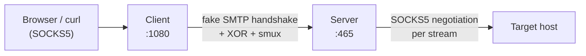

# 🔒 Proxy-Over-SMTP

**Proxy-Over-SMTP** is a SOCKS5 proxy tunnel that disguises its traffic as an SMTP session and XOR-obfuscates the payload to confuse Deep Packet Inspection (DPI). This project is inspired by [smtp-tunnel-proxy](https://github.com/x011/smtp-tunnel-proxy).

A **client** exposes a local SOCKS5 port. A **server** answers a fake SMTP handshake, then carries every proxied connection as a multiplexed stream inside a single TCP connection.

---

## ✨ Why Proxy-Over-SMTP?

*   **🎭 SMTP Disguise:** Every connection opens with a plausible `220` / `EHLO` / `DATA` exchange before tunneling starts.
*   **🧩 XOR Obfuscation:** Payload is XORed with a rolling key derived from your shared secret.
*   **⚡ Multiplexed Tunnel:** One TCP connection carries many streams via [smux](https://github.com/xtaci/smux), with keepalive, for low latency and fewer handshakes.
*   **🧦 Standard SOCKS5:** Works with browsers, `curl`, and anything that speaks SOCKS5 (IPv4, IPv6 and domain targets).
*   **🛑 Graceful Shutdown:** Active connections drain on `SIGINT` / `SIGTERM` (5s limit).
*   **📝 Audit Log:** Every tunnel (`peer -> target`) logged to stdout and file.
*   **📦 Static Binaries:** `CGO_ENABLED=0` builds for Linux, macOS, and Windows, plus a Docker image.

---

## 🏗️ Architecture at a Glance



See [docs/ARCHITECTURE.md](docs/ARCHITECTURE.md) and [docs/WORKFLOWS.md](docs/WORKFLOWS.md) for details.

---

## 🚀 Getting Started

### 📋 Prerequisites

*   **Go** (1.25+)
*   **Make** (For Builds)
*   **GoReleaser** *(Optional, for mass binaries)*
*   **Docker** *(Optional, for containers)*

---

## 🛠️ Deployment

### 🐳 **Using Container**

1.  **Install Docker** following the [official guide](https://docs.docker.com/desktop/).
2.  **Run the server side:**
    ```sh
    docker run -d \
      -p 465:465 \
      --name proxy-over-smtp-server \
      --rm dimaskiddo/proxy-over-smtp:latest \
      proxy-over-smtp -secret "THIS_IS_YOUR_SECRET_WORD" -mode server -server "0.0.0.0:465"
    ```
3.  **Run the client side:**
    ```sh
    docker run -d \
      -p 1080:1080 \
      --name proxy-over-smtp-client \
      --rm dimaskiddo/proxy-over-smtp:latest \
      proxy-over-smtp -secret "THIS_IS_YOUR_SECRET_WORD" -mode client -client "0.0.0.0:1080" -remote "192.168.1.100:465"
    ```
4.  Point your browser to SOCKS version 5 at `127.0.0.1:1080` (or your client port).

### 📦 **Using Pre-Built Binaries**

1.  Download the latest release from the [Releases Page](https://github.com/dimaskiddo/proxy-over-smtp/releases) and extract it.
2.  **Run server and client:**

#### 🐧 **Linux / 🍎 macOS**
```sh
chmod 755 proxy-over-smtp

# Server
./proxy-over-smtp -secret "THIS_IS_YOUR_SECRET_WORD" -mode server -server "0.0.0.0:465"

# Client
./proxy-over-smtp -secret "THIS_IS_YOUR_SECRET_WORD" -mode client -client "0.0.0.0:1080" -remote "192.168.1.100:465"
```

#### 🪟 **Windows**
*(Double click or use PowerShell)*
```powershell
# Server
.\proxy-over-smtp.exe -secret "THIS_IS_YOUR_SECRET_WORD" -mode server -server "0.0.0.0:465"

# Client
.\proxy-over-smtp.exe -secret "THIS_IS_YOUR_SECRET_WORD" -mode client -client "0.0.0.0:1080" -remote "192.168.1.100:465"
```

### 🏗️ **Build From Source**

```sh
git clone -b master https://github.com/dimaskiddo/proxy-over-smtp.git
cd proxy-over-smtp

make vendor    # Pull vendor packages
make run       # Run from source
make build     # Build binary for this platform
make release   # (Optional) Mass binaries via GoReleaser, output in dist/
```

---

## 🕹️ Usage

Server and client use the same binary. The same `-secret` must be set on both sides.

| Flag | Default | Purpose |
|---|---|---|
| `-mode` | `server` | `server` or `client` |
| `-server` | `0.0.0.0:465` | Server listen address |
| `-client` | `0.0.0.0:1080` | Client SOCKS5 listen address |
| `-remote` | `127.0.0.1:465` | Server address the client dials |
| `-secret` | `THIS_IS_YOUR_SECRET_WORD` | Shared secret (EHLO token and XOR key). Must not be empty. **Change it.** |
| `-allow-private` | `false` | Server: allow targets in loopback, private and link-local ranges (blocked by default) |
| `-log-file` | `./proxy-over-smtp.log` | Audit log path |

Quick check through the client:

```sh
curl --socks5-hostname 127.0.0.1:1080 https://example.com
```

### 📁 Log Files

Audit lines go to stdout and the `-log-file` file with an `AUDIT:` prefix, for example `Tunnel: <client-ip:port> -> <target:port>`, `Failed to Reach <target:port>: <error>`, `Shutdown Complete`.

---

## 📚 Documentation

*   [Architecture](docs/ARCHITECTURE.md): module map, handshake, transport stack, design decisions.
*   [Workflows](docs/WORKFLOWS.md): pipeline flows and error recovery.

---

## 🧪 Testing

```sh
go test ./...
```

---

## ✍️ Authors

*   **Dimas Restu Hidayanto** - *Initial Work* - [DimasKiddo](https://github.com/dimaskiddo)

See also the list of [contributors](https://github.com/dimaskiddo/proxy-over-smtp/contributors) who participated in this project.

---

## 🏗️ Dependencies

*   **[Go](https://golang.org/)**
*   **[xtaci/smux](https://github.com/xtaci/smux)** - Stream multiplexer
*   **[GoReleaser](https://github.com/goreleaser/goreleaser)** - Automated binaries build
*   **[Make](https://www.gnu.org/software/make/)** - Automated execution
*   **[Docker](https://www.docker.com/)** - Containerization

---

## ⚠️ Disclaimer

**DO WITH YOUR OWN RISK (DWYR)**. This software is provided "as is", without warranty of any kind, express or implied. The authors are not responsible for any damage caused by the use of this application.

**This is obfuscation, not encryption.** XOR hides patterns from naive DPI only. The secret is sent in plaintext in the `EHLO` line and there is no TLS. Do not rely on it for confidentiality.

---

## ⚖️ License

Distributed under the **MIT License**. See [LICENSE](LICENSE) for more information.
