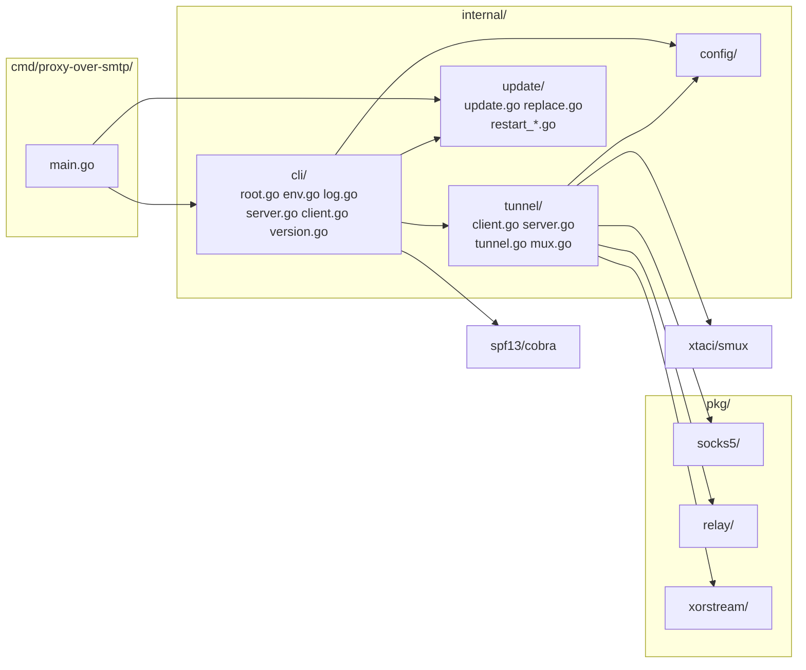
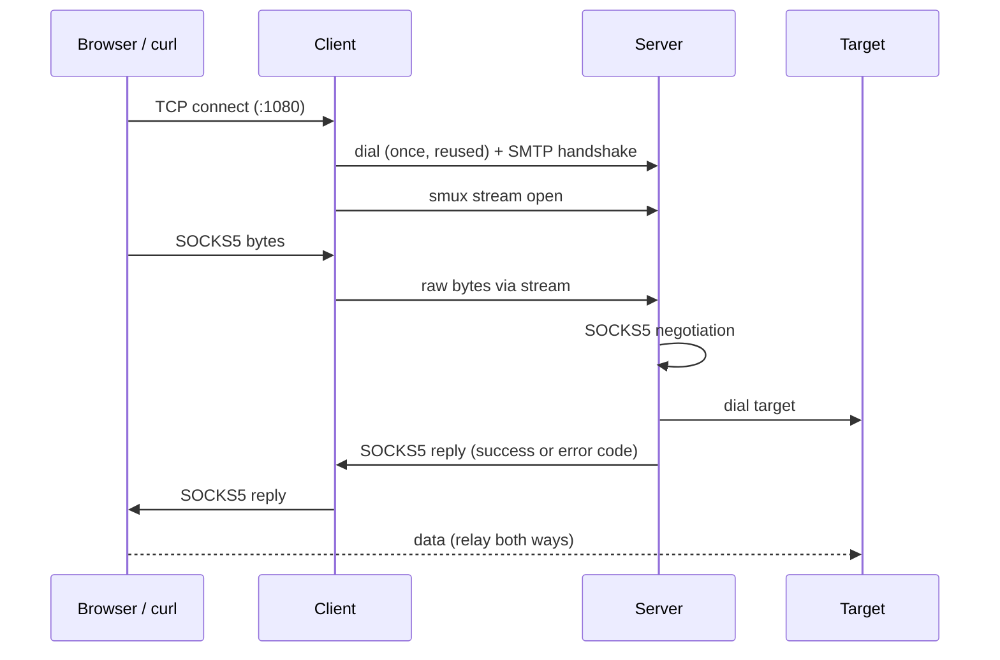

# Proxy-Over-SMTP — Architecture

SOCKS5 proxy in Go. A client accepts local SOCKS5 connections and forwards raw bytes through one multiplexed tunnel to a server. The tunnel opens with a fake SMTP handshake, then runs XOR-obfuscated smux. The server speaks SOCKS5 per stream and dials the target. **Config defaults:** see `internal/config/config.go` — never guess values.

---

## Module Map



---

## 1. Client / Server Model



| Component | Package | Role |
|---|---|---|
| **Entry** | `cmd/proxy-over-smtp/` | Signal context, build info (ldflags), call `cli.Execute` |
| **CLI** | `internal/cli/` | Cobra commands (`server`, `client`, `version`, `update`), env-to-flag fallback, `slog` logger, graceful drain |
| **Tunnel** | `internal/tunnel/` | `Tunnel` struct: config, `*slog.Logger`, connection `WaitGroup`, shared client session |
| **Client** | `internal/tunnel/client.go` | Local listener. Does **not** parse SOCKS: pipes raw local bytes into a new smux stream. Browser SOCKS5 handshake is therefore answered by the server |
| **Server** | `internal/tunnel/server.go` | Listener, SMTP handshake, smux server, per-stream SOCKS5 + dial + relay |
| **Update** | `internal/update/` | Release lookup, verified download, self-replace, re-exec |
| **Mux** | `internal/tunnel/mux.go` | Shared smux config for both sides |
| **SOCKS5** | `pkg/socks5/` | Server-side negotiation, returns `host:port` |
| **Relay** | `pkg/relay/` | Bidirectional copy |
| **XOR Stream** | `pkg/xorstream/` | XOR wrapper over `io.ReadWriter` |

---

## 2. Handshake (fake SMTP)

All reads and writes run under a 30s deadline, cleared after `354`.

| Step | Direction | Bytes | Check |
|---|---|---|---|
| 1 | S→C | `220 mail.google.com ESMTP` | Client requires prefix `220` |
| 2 | C→S | `EHLO <secret>` | Server requires an **exact**, constant-time match of the line |
| 3 | S→C | `250-OK` / `250 STARTTLS` | Client reads until a line starting `250 ` |
| 4 | C→S | `DATA` | Server requires the line to equal `DATA` |
| 5 | S→C | `354 Go ahead` | Client requires prefix `354` |

Any failure closes the connection with no reply. `STARTTLS` is advertised only for disguise: no TLS follows.

---

## 3. Transport Stack

```
TCP
 └─ fake SMTP handshake (plain text, once per connection)
     └─ XOR stream (key = secret)
         └─ smux session (one per client, many streams)
             └─ per stream: SOCKS5 negotiation, then relay to target
```

**XOR stream** (`pkg/xorstream`): separate rolling offsets for read and write, each advanced by bytes processed, wrapped at key length. Separate read and write mutexes. Both ends must use the same secret.

**smux** (`internal/tunnel/mux.go`):

| Setting | Value |
|---|---|
| Base | `smux.DefaultConfig()` |
| `Version` | 2 (per-stream flow control) |
| `MaxReceiveBuffer` | 16MB per session |
| `MaxStreamBuffer` | 512KB per stream |
| `KeepAliveDisabled` | `false` |
| `KeepAliveInterval` | 15s |
| `KeepAliveTimeout` | 60s |

---

## 4. SOCKS5 (`pkg/socks5/socks5.go`)

| Aspect | Behavior |
|---|---|
| Version | Must be `0x05` |
| Auth methods | Requires no-auth (`0x00`) in the offered list, else replies `0xFF` |
| Address types | IPv4 (`0x01`), domain (`0x03`, non-empty), IPv6 (`0x04`). Others: reply `0x08` |
| Command | CONNECT only. Others: reply `0x07` |
| Reply | Sent after the dial. Success carries the local bound address. Failures map to `0x02` blocked, `0x03` network, `0x04` host/DNS/timeout, `0x05` refused, `0x01` other |
| Target ACL | Loopback, private, link-local, multicast and unspecified targets are refused after DNS resolution unless `--allow-private` is set |

---

## 5. Relay (`pkg/relay/relay.go`)

Two `io.CopyBuffer` goroutines (one per direction) with 32KB buffers from a `sync.Pool`. The reader and writer are wrapped so `WriterTo`/`ReaderFrom` fast paths cannot bypass the pool. When the first direction ends, `Pipe` closes both ends and returns only after both copies have exited.

---

## 6. Configuration & Logging (`internal/cli/`, `internal/config/config.go`)

Commands: `proxy-over-smtp server`, `proxy-over-smtp client`, `proxy-over-smtp update [--check] [--force]`, `proxy-over-smtp version` (also `--version`).

Precedence: command-line flag, then environment variable, then default. The env name is `PROXY_OVER_SMTP_` plus the flag name uppercased with `-` as `_`. `--help` shows each name.

| Flag | Env | Default | Commands | Purpose |
|---|---|---|---|---|
| `--listen` | `PROXY_OVER_SMTP_LISTEN` | server `0.0.0.0:465`, client `0.0.0.0:1080` | server, client | Listen address |
| `--remote` | `PROXY_OVER_SMTP_REMOTE` | `127.0.0.1:465` | client | Server address dialed by client |
| `--secret` | `PROXY_OVER_SMTP_SECRET` | none, **required** | server, client | EHLO token and XOR key. Prefer the env var: argv is visible in `ps` |
| `--allow-private` | `PROXY_OVER_SMTP_ALLOW_PRIVATE` | `false` | server | Allow loopback/private/link-local targets |
| `--log-level` | `PROXY_OVER_SMTP_LOG_LEVEL` | `info` | all | `debug`, `info`, `warn`, `error` |
| `--log-format` | `PROXY_OVER_SMTP_LOG_FORMAT` | `text` | all | `text` or `json` |
| `--log-file` | `PROXY_OVER_SMTP_LOG_FILE` | empty | all | Also append logs to this file. Stdout only when empty |
| `--auto-update` | `PROXY_OVER_SMTP_AUTO_UPDATE` | `false` | server, client | Periodic release check, swap and re-exec |
| `--update-interval` | `PROXY_OVER_SMTP_UPDATE_INTERVAL` | `24h` | server, client | Check interval, minimum `1h` |

Logging: `log/slog` with structured key/value fields, written to stdout as an event stream. Key events: `server listening`, `client listening`, `tunnel opened` (`peer`, `target`), `target unreachable` (warn), `shutdown complete`. Handshake and SOCKS rejections log at debug. The secret is never logged.

---

## 7. Concurrency & Shutdown

- **Accept loop:** shared by both modes. Accept errors retry with 5ms–1s backoff.
- **Per connection:** one goroutine tracked in `Tunnel.conns`. `context.AfterFunc` closes the connection on cancel and is released when the handler returns.
- **Per smux stream (server):** one goroutine tracked in `Tunnel.conns`: 30s deadline for SOCKS5, dial, reply, relay.
- **Client session:** `Tunnel.sess` guarded by `sessMu`. Created lazily, re-dialed when closed. A failed stream open drops the session and retries once on a fresh one. Closed on shutdown.
- **Shutdown:** `SIGINT`/`SIGTERM` cancels the context → listeners close, sessions close → the CLI waits up to 5s on `Tunnel.Wait()` → logs `shutdown complete` or `shutdown timed out, forcing exit`.

---

## 7a. Self-update (`internal/update/`)

1. `Latest` reads the GitHub `releases/latest` JSON (`tag_name`, asset names and URLs). Hidden `--update-api` overrides the endpoint for tests and mirrors.
2. `assetName` maps GOOS/GOARCH to the GoReleaser archive name `proxy-over-smtp_<ver>_<os>_<arch>.zip` (darwin→macos, 386→32-bit, amd64→64-bit, arm64→arm-64-bit). It is coupled to `.goreleaser.yml`: rename one, rename the other.
3. `Apply` downloads the zip and `checksums.txt` (100MB cap each), requires a sha256 match, extracts the binary in memory.
4. `replace` writes a temp file beside the executable with the original mode, fsyncs, then renames over it (atomic on POSIX). On Windows the running exe is first renamed to `<exe>.old`, removed best-effort on the next update.
5. Auto-update (in `internal/cli/update.go`) sets `app.restart` and cancels the run context, so the normal drain runs. `main` then calls `update.Restart()`: `syscall.Exec` on Unix (same PID), a child process plus exit on Windows.

`Newer` compares `X.Y.Z` only and ignores any `-pre`/`+meta` suffix. `dev` builds never auto-update and need `--force` for manual update. The checksum comes from the same release as the archive, so it proves integrity, not authenticity: there is no signing.

---

## 8. Key Design Decisions

1. **Fake SMTP handshake** — first bytes look like a mail session to naive DPI.
2. **XOR is obfuscation, not encryption** — the secret is sent in plaintext in `EHLO` and there is no TLS. Do not rely on confidentiality.
3. **Single multiplexed session** — one TCP + handshake per client, many streams via smux. Lower latency, fewer connections.
4. **SOCKS parsed server-side** — client stays a dumb byte pipe.
5. **Reusable code in `pkg/`** — XOR stream, SOCKS5 and relay carry no app state. App wiring stays in `internal/`.
6. **Stdlib first** — third-party dependencies are `xtaci/smux` (multiplexer) and `spf13/cobra` (CLI). No viper: env fallback is a small pflag walker in `internal/cli/env.go`.
7. **Target ACL on by default** — the server is an outbound proxy for anyone holding the secret, so private ranges are blocked unless `--allow-private`. Uses stdlib predicates only (CGNAT `100.64.0.0/10` not covered).
8. **Static builds** — `CGO_ENABLED=0`, cross-compiled by GoReleaser (darwin/linux/windows × 386/amd64/arm64). Version, commit and date are injected via ldflags.
9. **Twelve-factor** — config only from flags and env (no default secret), logs as a stdout event stream, stateless processes, port binding via `--listen`, graceful SIGTERM drain, `version` as an admin command.
10. **smux v2 per-stream windows** — with v1 one unread stream fills the shared session buffer and stalls every stream. Limitation: smux has no half-close, so a client that only shuts down its write side (e.g. `nc -N`) loses the response.
11. **Self-update from stdlib** — no update library; `net/http`, `archive/zip` and `crypto/sha256` cover it. Auto-update is opt-in because it can split server and client versions.
