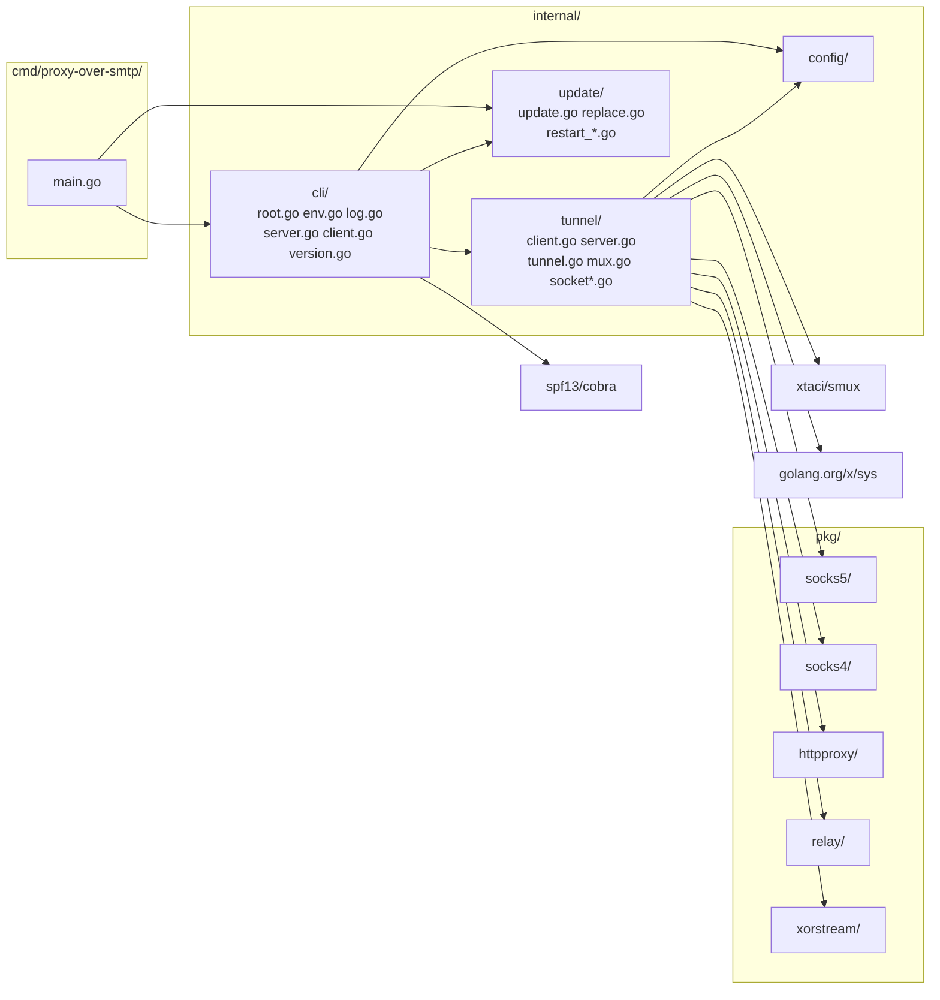
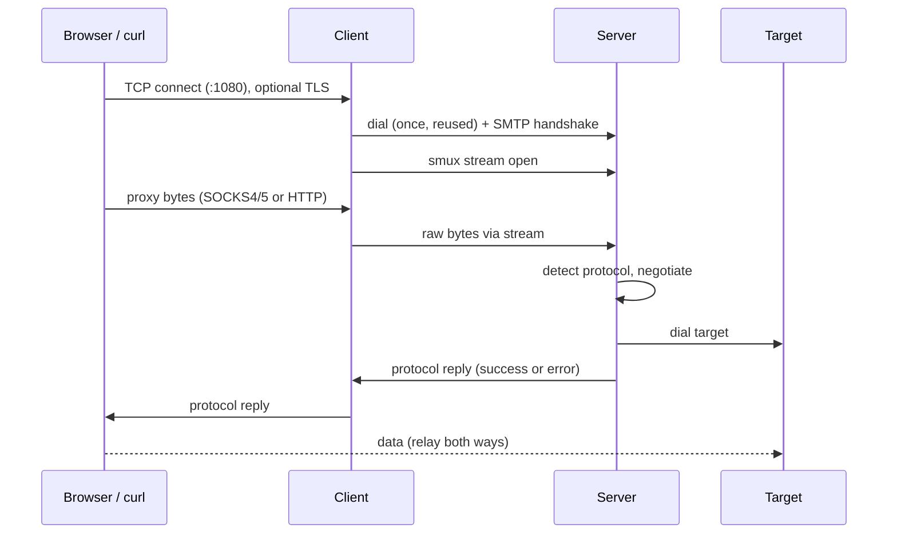

# Proxy-Over-SMTP — Architecture

Multi-protocol proxy in Go (SOCKS4/4a, SOCKS5, HTTP, HTTPS). A client accepts local proxy connections and forwards raw bytes through one multiplexed tunnel to a server. The tunnel opens with a fake SMTP handshake, then runs XOR-obfuscated smux. The server detects the proxy protocol per stream, negotiates it and dials the target. **Config defaults:** see `internal/config/config.go` — never guess values.

---

## Module Map



---

## 1. Client / Server Model



| Component | Package | Role |
|---|---|---|
| **Entry** | `cmd/proxy-over-smtp/` | Signal context, build info (ldflags), call `cli.Execute` |
| **CLI** | `internal/cli/` | Cobra commands (`server`, `client`, `version`, `update`), env-to-flag fallback, `slog` logger, graceful drain |
| **Tunnel** | `internal/tunnel/` | `Tunnel` struct: config, `*slog.Logger`, TLS config, connection `WaitGroup`, active counter, hard-stop context, shared client session. `Shutdown` drains |
| **Client** | `internal/tunnel/client.go` | Local listener. Does **not** parse proxy protocols: pipes raw local bytes into a new smux stream, so the server answers the handshake. Only exception: terminates TLS when `--tls-cert`/`--tls-key` are set and the first byte is a TLS ClientHello |
| **Server** | `internal/tunnel/server.go` | Listener, SMTP handshake, smux server, per-stream protocol detection + negotiation + dial + relay |
| **Update** | `internal/update/` | Release lookup, verified download, self-replace, re-exec |
| **Mux** | `internal/tunnel/mux.go` | Shared smux config for both sides |
| **Socket** | `internal/tunnel/socket*.go` | Tuned listener and dialer for all four TCP sockets. Per-OS option calls |
| **SOCKS5** | `pkg/socks5/` | Server-side negotiation, returns `host:port` |
| **SOCKS4** | `pkg/socks4/` | SOCKS4/4a request parser and reply writer, returns `host:port` |
| **HTTP proxy** | `pkg/httpproxy/` | CONNECT and absolute-form request parser, status writer, request forwarder |
| **Relay** | `pkg/relay/` | Bidirectional copy |
| **XOR Stream** | `pkg/xorstream/` | XOR wrapper over `io.ReadWriter` |

---

## 2. Handshake (fake SMTP)

All reads and writes run under a 30s deadline, cleared after `354`.

| Step | Direction | Bytes | Check |
|---|---|---|---|
| 1 | S→C | `220 mail.google.com ESMTP` | Client requires prefix `220` |
| 2 | C→S | `EHLO <secret>` | Server requires an **exact**, constant-time match of the line |
| 3 | S→C | `250-OK` / `250 STARTTLS` | Client reads until a line starting `250 ` |
| 4 | C→S | `DATA` | Server requires the line to equal `DATA` |
| 5 | S→C | `354 Go ahead` | Client requires prefix `354` |

Any failure closes the connection with no reply. `STARTTLS` is advertised only for disguise: no TLS follows.

---

## 3. Transport Stack

```
TCP
 └─ fake SMTP handshake (plain text, once per connection)
     └─ XOR stream (key = secret)
         └─ smux session (one per client, many streams)
             └─ per stream: protocol detect + negotiation, then relay to target
```

**XOR stream** (`pkg/xorstream`): separate rolling offsets for read and write, each advanced by bytes processed, wrapped at key length. Separate read and write mutexes. Both ends must use the same secret.

**smux** (`internal/tunnel/mux.go`):

| Setting | Value |
|---|---|
| Base | `smux.DefaultConfig()` |
| `Version` | 2 (per-stream flow control) |
| `MaxReceiveBuffer` | 16MB per session |
| `MaxStreamBuffer` | 512KB per stream |
| `KeepAliveDisabled` | `false` |
| `KeepAliveInterval` | 15s |
| `KeepAliveTimeout` | 60s |

---

## 4. Proxy Protocols

### Detection (server, per smux stream)

`handleStream` wraps the stream in a 64KB `LimitedReader` (caps header memory, raised to unlimited once the request is parsed) and a `bufio.Reader`, then peeks one byte under the 30s deadline.

| First byte | Protocol | Parser |
|---|---|---|
| `0x05` | SOCKS5 | `pkg/socks5` |
| `0x04` | SOCKS4 / 4a | `pkg/socks4` |
| `A`-`Z` | HTTP (CONNECT or absolute-form) | `pkg/httpproxy` |
| other | rejected, stream closed, debug log `proxy request rejected` | none |

Because the client forwards raw bytes, adding protocols needs no wire change: old clients work with new servers.

### TLS listener (client)

`handleClient` peeks the first local byte under a 30s deadline, before opening any smux stream. `0x16` (TLS ClientHello) with a configured certificate: `tls.Server` (min TLS 1.2) terminates TLS and the decrypted bytes are piped as usual. `0x16` without a certificate: connection closed, debug log `tls not enabled`. Anything else is piped untouched. TLS protects only the application-to-client hop.

### SOCKS5 (`pkg/socks5/socks5.go`)

| Aspect | Behavior |
|---|---|
| Version | Must be `0x05` |
| Auth methods | Requires no-auth (`0x00`) in the offered list, else replies `0xFF` |
| Address types | IPv4 (`0x01`), domain (`0x03`, non-empty), IPv6 (`0x04`). Others: reply `0x08` |
| Command | CONNECT only. Others: reply `0x07` |
| Reply | Sent after the dial. Success carries the local bound address. Failures map to `0x02` blocked, `0x03` network, `0x04` host/DNS/timeout, `0x05` refused, `0x01` other |
| Target ACL | Loopback, private, link-local, multicast and unspecified targets are refused after DNS resolution unless `--allow-private` is set |

### SOCKS4 / 4a (`pkg/socks4/socks4.go`)

| Aspect | Behavior |
|---|---|
| Request | `VN=4`, `CD=1` (CONNECT) only. BIND is rejected |
| User ID | Read and ignored (no authentication) |
| SOCKS4a | Destination IP `0.0.0.x` (x not 0) is followed by a NUL-terminated domain |
| Limits | User ID and domain are each capped at 255 bytes |
| Reply | `0x5A` granted, `0x5B` for every failure, including a blocked target |

### HTTP (`pkg/httpproxy/httpproxy.go`)

| Aspect | Behavior |
|---|---|
| `CONNECT host[:port]` | Target defaults to port 443. Reply `200 Connection established`, then raw relay |
| Absolute-form `GET http://host/path` | Only `http` scheme, port defaults to 80. Rewritten to origin-form and written to the target, then the response is relayed |
| Header handling | Hop-by-hop headers (`Proxy-Connection`, `Proxy-Authorization`, `Connection` and the headers it names, `Keep-Alive`, `TE`, `Trailer`, `Upgrade`, `Transfer-Encoding`) are stripped. `Connection: close` is forced, so one request per proxied connection |
| Other requests | Origin-form or non-http schemes: `400` |
| Failed dial | Blocked target `403`, timeout `504`, anything else `502` |

---

## 4a. Socket options

Implemented in `internal/tunnel/socket*.go`. Fixed in code: no flags, no env vars. They apply to all four TCP sockets: server listener, server-to-target dial, client listener and client-to-server dial. Accepted connections inherit buffer sizes from the listener. Options are set in the `Control` hook, after `socket()` and before `bind()` or `connect()`, so they take effect for window scaling. A failed `setsockopt` fails the listen or dial. The target ACL runs before them on server dials.

| Option | Value | Sockets | OS |
|---|---|---|---|
| `SO_RCVBUF`, `SO_SNDBUF` | 4096 | all | all |
| `TCP_NODELAY` | on | all | all |
| TCP keepalive | idle 15s, interval 15s, 9 probes | all | all |
| `SO_REUSEADDR` | on | listeners | Unix only |
| `SO_REUSEPORT` | on | listeners | Unix only |

Consequences:

- A fixed buffer turns off kernel autotuning. All streams share one tunnel connection, so throughput is capped near buffer/RTT: about 80KB/s at 50ms RTT. Linux stores double the value (`ss` shows `rb8192`) and window scaling stays off (`wscale 0`). To change it, edit `sockBuffer` in `socket.go`.
- `SO_REUSEPORT` lets a new binary bind the port while the old one drains (zero-downtime restart). It also means a second server accidentally started on the same port succeeds, and the kernel splits connections between both processes.
- Windows has no `SO_REUSEPORT`, and its `SO_REUSEADDR` lets another process take a bound port, so neither is set there.
- Keepalive also covers target sockets, which have no smux keepalive.

---

## 5. Relay (`pkg/relay/relay.go`)

Two `io.CopyBuffer` goroutines (one per direction) with 32KB buffers from a `sync.Pool`. The reader and writer are wrapped so `WriterTo`/`ReaderFrom` fast paths cannot bypass the pool. When the first direction ends, `Pipe` closes both ends and returns only after both copies have exited.

---

## 6. Configuration & Logging (`internal/cli/`, `internal/config/config.go`)

Commands: `proxy-over-smtp server`, `proxy-over-smtp client`, `proxy-over-smtp update [--check] [--force]`, `proxy-over-smtp version` (also `--version`).

Precedence: command-line flag, then environment variable, then default. The env name is `PROXY_OVER_SMTP_` plus the flag name uppercased with `-` as `_`. `--help` shows each name.

| Flag | Env | Default | Commands | Purpose |
|---|---|---|---|---|
| `--listen` | `PROXY_OVER_SMTP_LISTEN` | server `0.0.0.0:465`, client `0.0.0.0:1080` | server, client | Listen address |
| `--remote` | `PROXY_OVER_SMTP_REMOTE` | `127.0.0.1:465` | client | Server address dialed by client |
| `--secret` | `PROXY_OVER_SMTP_SECRET` | none, **required** | server, client | EHLO token and XOR key. Prefer the env var: argv is visible in `ps` |
| `--allow-private` | `PROXY_OVER_SMTP_ALLOW_PRIVATE` | `false` | server | Allow loopback/private/link-local targets |
| `--tls-cert` | `PROXY_OVER_SMTP_TLS_CERT` | empty | client | PEM certificate for the TLS proxy listener |
| `--tls-key` | `PROXY_OVER_SMTP_TLS_KEY` | empty | client | PEM key. Must be set together with `--tls-cert` |
| `--drain-timeout` | `PROXY_OVER_SMTP_DRAIN_TIMEOUT` | `30s` | server, client | Shutdown drain limit. Negative is rejected |
| `--log-level` | `PROXY_OVER_SMTP_LOG_LEVEL` | `info` | all | `debug`, `info`, `warn`, `error` |
| `--log-format` | `PROXY_OVER_SMTP_LOG_FORMAT` | `text` | all | `text` or `json` |
| `--log-file` | `PROXY_OVER_SMTP_LOG_FILE` | empty | all | Also append logs to this file. Stdout only when empty |
| `--auto-update` | `PROXY_OVER_SMTP_AUTO_UPDATE` | `false` | server, client | Periodic release check, swap and re-exec |
| `--update-interval` | `PROXY_OVER_SMTP_UPDATE_INTERVAL` | `24h` | server, client | Check interval, minimum `1h` |

Logging: `log/slog` with structured key/value fields, written to stdout as an event stream. Key events: `server listening`, `client listening`, `tunnel opened` (`peer`, `target`, `proto` = `socks5`, `socks4`, `http`, `http-connect`), `draining` (`active`, `timeout`), `target unreachable` (warn), `shutdown complete`, `drain interrupted, connections closed` (warn). Handshake and protocol rejections log at debug. The secret is never logged.

---

## 7. Concurrency & Shutdown

- **Accept loop:** shared by both modes. Accept errors retry with 5ms–1s backoff.
- **Per connection:** one goroutine tracked in `Tunnel.conns`. `context.AfterFunc` closes the connection on cancel and is released when the handler returns.
- **Per smux stream (server):** one goroutine tracked in `Tunnel.conns`: 30s deadline for detection, negotiation, dial and reply, then relay.
- **Client session:** `Tunnel.sess` guarded by `sessMu`. Created lazily, re-dialed when closed. A failed stream open drops the session and retries once on a fresh one. Closed by `Shutdown` after the drain.
- **Active counter:** `Tunnel.Active()` is an atomic count of tracked handlers, used for the `draining` log.

### Graceful drain

1. `SIGINT`/`SIGTERM` cancels the run context. `RunServer`/`RunClient` only stop accepting and return. Existing connections are not touched.
2. The CLI logs `draining` and calls `Tunnel.Shutdown(ctx)` with `--drain-timeout`. `Shutdown` waits for all tracked handlers.
3. Server sessions refuse new streams once draining starts and close themselves when their last stream ends, so idle sessions close at once. The client keeps using its shared session for in-flight relays.
4. When handlers finish, `Shutdown` cancels the internal hard context, closes sessions and returns nil: log `shutdown complete`.
5. If the drain context expires, or a second signal arrives, the hard context is cancelled first. That closes every connection and session, and `Shutdown` returns the context error: warn `drain interrupted, connections closed`. A bounded grace (5s) then waits for handler goroutines to exit.

Auto-update restart takes the same path before re-exec.

---

## 7a. Self-update (`internal/update/`)

1. `Latest` reads the GitHub `releases/latest` JSON (`tag_name`, asset names and URLs). Hidden `--update-api` overrides the endpoint for tests and mirrors.
2. `assetName` maps GOOS/GOARCH to the GoReleaser archive name `proxy-over-smtp_<ver>_<os>_<arch>.zip` (darwin→macos, 386→32-bit, amd64→64-bit, arm64→arm-64-bit). It is coupled to `.goreleaser.yml`: rename one, rename the other.
3. `Apply` downloads the zip and `checksums.txt` (100MB cap each), requires a sha256 match, extracts the binary in memory.
4. `replace` writes a temp file beside the executable with the original mode, fsyncs, then renames over it (atomic on POSIX). On Windows the running exe is first renamed to `<exe>.old`, removed best-effort on the next update.
5. Auto-update (in `internal/cli/update.go`) sets `app.restart` and cancels the run context, so the normal drain runs. `main` then calls `update.Restart()`: `syscall.Exec` on Unix (same PID), a child process plus exit on Windows.

`Newer` compares `X.Y.Z` only and ignores any `-pre`/`+meta` suffix. `dev` builds never auto-update and need `--force` for manual update. The checksum comes from the same release as the archive, so it proves integrity, not authenticity: there is no signing.

---

## 8. Key Design Decisions

1. **Fake SMTP handshake** — first bytes look like a mail session to naive DPI.
2. **XOR is obfuscation, not encryption** — the secret is sent in plaintext in `EHLO` and there is no TLS. Do not rely on confidentiality.
3. **Single multiplexed session** — one TCP + handshake per client, many streams via smux. Lower latency, fewer connections.
4. **Protocols parsed server-side** — the client stays a dumb byte pipe, so detection on the server adds SOCKS4 and HTTP without changing the wire format. The only client-side parsing is the TLS ClientHello check, and only when a certificate is configured.
5. **Reusable code in `pkg/`** — XOR stream, SOCKS4/5, HTTP proxy parsing and relay carry no app state. App wiring stays in `internal/`.
6. **Stdlib first** — third-party dependencies are `xtaci/smux` (multiplexer), `spf13/cobra` (CLI) and `golang.org/x/sys` (per-OS socket option constants, which `syscall` lacks for `SO_REUSEPORT` on Linux). No viper: env fallback is a small pflag walker in `internal/cli/env.go`.
7. **Target ACL on by default** — the server is an outbound proxy for anyone holding the secret, so private ranges are blocked unless `--allow-private`. Uses stdlib predicates only (CGNAT `100.64.0.0/10` not covered).
8. **Static builds** — `CGO_ENABLED=0`, cross-compiled by GoReleaser (darwin/linux/windows × 386/amd64/arm64). Version, commit and date are injected via ldflags.
9. **Twelve-factor** — config only from flags and env (no default secret), logs as a stdout event stream, stateless processes, port binding via `--listen`, graceful SIGTERM drain, `version` as an admin command.
10. **smux v2 per-stream windows** — with v1 one unread stream fills the shared session buffer and stalls every stream. Limitation: smux has no half-close, so a client that only shuts down its write side (e.g. `nc -N`) loses the response.
11. **Self-update from stdlib** — no update library; `net/http`, `archive/zip` and `crypto/sha256` cover it. Auto-update is opt-in because it can split server and client versions.
12. **One HTTP request per connection** — plain HTTP forwarding sets `Connection: close` and strips hop-by-hop headers. Keep-alive across different hosts would need a request loop; modern clients use `CONNECT` for HTTPS, which is a raw relay.
13. **Drain before close** — listeners stop first and connections finish on their own, bounded by `--drain-timeout`. A second signal forces. Container and orchestrator grace periods must exceed the drain timeout.
14. **Socket options fixed in code** — buffers, `TCP_NODELAY`, keepalive and reuse flags are constants, not settings: one tested profile, no per-deployment tuning to get wrong. Cost: no runtime override of the 4096 buffers. See [Socket options](#4a-socket-options).
15. **Doc comments** — Google Go style: a package comment per package, a doc comment starting with the name on every exported and non-trivial unexported symbol, bodies comment only the why.
