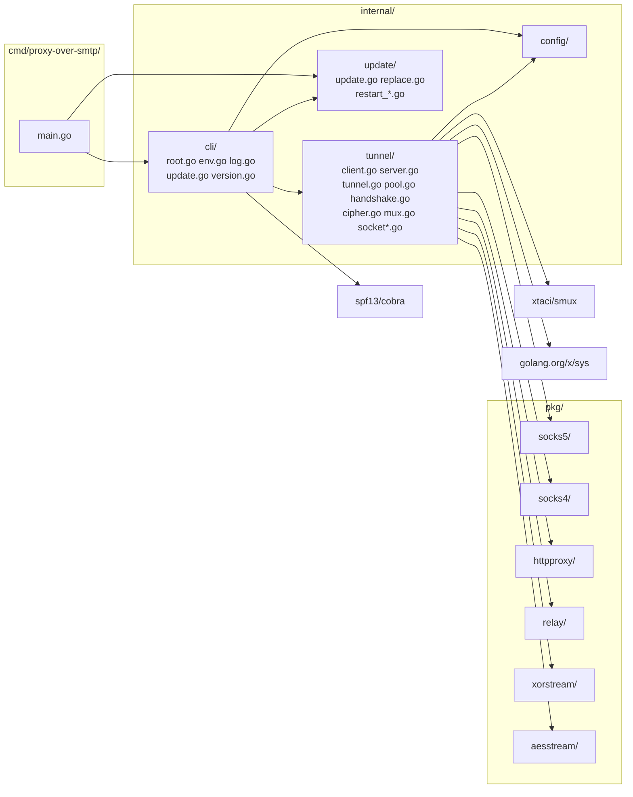
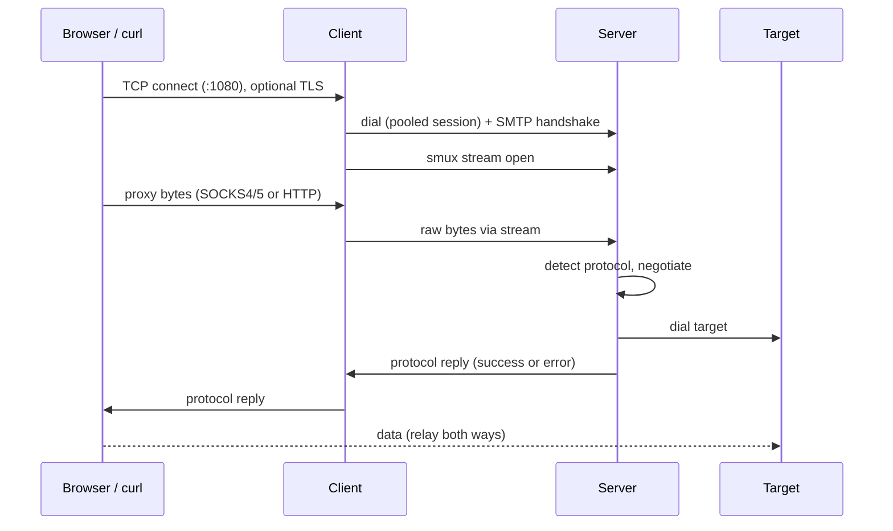

# Proxy-Over-SMTP — Architecture

Multi-protocol proxy in Go (SOCKS4/4a, SOCKS5, HTTP, HTTPS). A client accepts local proxy connections and forwards raw bytes through one multiplexed tunnel to a server. The tunnel opens with a fake SMTP challenge-response handshake, then carries a selectable XOR or AES-256-GCM protected smux session. The server detects the proxy protocol per stream, negotiates it and dials the target. **Config defaults:** see `internal/config/config.go` — never guess values.

---

## Module Map



---

## 1. Client / Server Model



| Component | Package | Role |
|---|---|---|
| **Entry** | `cmd/proxy-over-smtp/` | Signal context, build info (ldflags), call `cli.Execute` |
| **CLI** | `internal/cli/` | Cobra commands (`server`, `client`, `version`, `update`), env-to-flag fallback, `slog` logger, graceful drain |
| **Tunnel** | `internal/tunnel/` | `Tunnel` struct: config, `*slog.Logger`, TLS config, connection `WaitGroup`, active counter, hard-stop context, client session pool. `Shutdown` drains |
| **Pool** | `internal/tunnel/pool.go` | Client-only: the slots, pick/grow/shrink, per-stream reservation. See §1.1 |
| **Handshake** | `internal/tunnel/handshake.go` | RFC 5321 envelope constants, challenge-response proof, key derivation, capped line reads. See §2 |
| **Cipher** | `internal/tunnel/cipher.go` | Picks the XOR or AES stream wrapper for a session |
| **Client** | `internal/tunnel/client.go` | Local listener. Does **not** parse proxy protocols: pipes raw local bytes into a new smux stream, so the server answers the handshake. Only exception: terminates TLS when `--tls-cert`/`--tls-key` are set and the first byte is a TLS ClientHello |
| **Server** | `internal/tunnel/server.go` | Listener, SMTP handshake, smux server, per-stream protocol detection + negotiation + dial + relay |
| **Update** | `internal/update/` | Release lookup, verified download, self-replace, re-exec |
| **Mux** | `internal/tunnel/mux.go` | Shared smux config for both sides |
| **Socket** | `internal/tunnel/socket*.go` | Tuned listener and dialer for all four TCP sockets. Per-OS option calls |
| **SOCKS5** | `pkg/socks5/` | Server-side negotiation, returns `host:port` |
| **SOCKS4** | `pkg/socks4/` | SOCKS4/4a request parser and reply writer, returns `host:port` |
| **HTTP proxy** | `pkg/httpproxy/` | CONNECT and absolute-form request parser, status writer, request forwarder |
| **Relay** | `pkg/relay/` | Bidirectional copy |
| **XOR Stream** | `pkg/xorstream/` | Rolling-key XOR wrapper over `io.ReadWriter` (obfuscation only) |
| **AES Stream** | `pkg/aesstream/` | AES-256-GCM record wrapper over `io.ReadWriter` (confidentiality and integrity) |

### 1.1 Session pool (`internal/tunnel/pool.go`)

One smux session per client caps a whole client at one TCP connection's worth of throughput. The client therefore keeps a pool of them, bounded by `--pool-min` (default 2) and `--pool-max` (default 8). The server is unchanged: it sees N connections instead of one, and each is capped by `--max-streams` as before.

A `slot` is one session plus its load counter, its single-dial gate and the time it last went idle. The rules:

- **Pick.** A local connection takes the healthy slot carrying the fewest streams, so load spreads instead of piling onto whichever session dialed first.
- **Reserve.** The pick increments the slot's stream counter while holding the pool lock. The reservation is what makes a slot being handed out immune to the shrink scan, and it is given back if the stream fails to open. That is the one piece of shared state the stream path cannot do without.
- **Grow.** Growth needs *all* slots loaded, not just the picked one: a slot counts as loaded at `max(4, MaxStreams/8)` streams. With `--max-streams 128` that is 16 streams, so a pool of two only opens a third session under real concurrency. Growth is single-flight per slot: while a dial runs, other callers wait on that slot's `dialing` channel and then take the least loaded slot, so a burst opens one extra TCP connection rather than one each.
- **Shrink.** There is no timer. A slot that drops to zero streams records when, and the *next* stream close scans for slots idle for 60s and closes them down to `--pool-min`. A pool therefore only releases a session because real traffic ended.
- **Eviction.** A peer restart leaves a session that `IsClosed` still reports as open until keepalive times out, so a failed `OpenStream` removes that slot and the open retries on another. `openStream` also prunes closed slots on every pick, which covers the common case where the death is already visible.

Every session runs its own handshake and derives its own directional keys from its own nonce. Keys are never shared between slots.

Both count ceilings are honest ones: the pool multiplies *aggregate* throughput, and a single TCP flow still rides a single session, capped by `window / RTT` and by one session's CPU cost. Raising `--pool-max` past what the uplink or the peer can carry just adds idle connections.

---

## 2. Handshake (fake SMTP, challenge-response)

The server sends a fresh 32-byte nonce; the client proves knowledge of the secret with an HMAC instead of sending it. All reads and writes run under a 30s deadline, cleared after `354`.

Every client line is a well-formed RFC 5321 command, so the session reads as an ordinary mail transaction rather than a bespoke protocol. The proof rides as the `X-PROOF` extension parameter on `MAIL FROM`, the one field where a visible string is legal, encoded as unpadded base64 so the value matches the `esmtp-value` grammar.

Commands are matched the way RFC 5321 §2.4 requires, case-insensitively, and `HELO` is accepted as an alias for `EHLO` — a relay that answered only `EHLO` would look newer than the mail server it imitates. The opening argument is not judged beyond its presence: §4.1.4 lets a server compare the name with the peer address but forbids refusing a message when that fails, so any single argument is accepted and a missing one draws the `501` a real relay sends. The proof is the exception to all folding: it is base64, so it is compared byte for byte.

| Step | Direction | Bytes | Check | RFC 5321 |
|---|---|---|---|---|
| 1 | S→C | `220 smtp.gmail.com ESMTP <b64-nonce>` | Client requires prefix `220`, then base64-decodes a 32-byte nonce | §4.1.1.1, §4.2 |
| 2 | C→S | `EHLO [192.0.2.10]` | Server accepts the line in any case with any single argument — the name belongs to the client (§4.1.4) — and takes `HELO` in place of `EHLO`; a missing argument gets `501` | §4.1.1.1 |
| 3a | S→C | `250-smtp.gmail.com` | First line of the `ehlo-ok-rsp` | §4.1.1.1 |
| 3b | S→C | `250 X-PROOF` | Client reads until a line starting `250 ` | §4.1.1.1, §2.2.2 |
| 4 | C→S | `MAIL FROM:<no-reply@gmail.com> X-PROOF=<b64-proof>` | Server matches the fixed prefix case-insensitively, then compares the proof parameter against `HMAC-SHA256(secret, "ehlo"‖nonce)` in unpadded base64, in constant time | §4.1.1.2 |
| 5 | S→C | `250 OK` | Client requires prefix `250` | §4.2 |
| 6 | C→S | `RCPT TO:<no-reply@gmail.com>` | Server accepts this line in any case | §4.1.1.3 |
| 7 | S→C | `250 OK` | Client requires prefix `250` | §4.2 |
| 8 | C→S | `DATA` | Server accepts this command in any case | §4.1.1.4 |
| 9 | S→C | `354 End data with <CR><LF>.<CR><LF>` | Client requires prefix `354` | §4.1.1.4 |

Failures are answered the way a real server answers them. `250 OK` acknowledges `NOOP` and `RSET`, which change no transaction state. `502 Command not implemented` refuses `VRFY`, `EXPN` and `HELP` — RFC 5321 §4.2.4 puts a recognized command the server does not offer on 502, not on 500. `500 Syntax error, command unrecognized` answers a malformed line and a bad proof with identical bytes, so no reply says which fired. A line ended by a bare LF and a line over 4KB are both malformed: RFC 5321 §4.1.1.4 says a server must not accept the first, and §4.2.2 counts the second as a syntax error. `501 Syntax error in parameters or arguments` answers a recognized opening verb whose argument is missing, which is the code a real relay returns for a bare `EHLO`; an argument that is present is never judged, since §4.1.4 forbids refusing a message over the name a client gives. `503 Bad sequence of commands` answers a command that arrives out of order: a transaction verb before the greeting, `RCPT` or `DATA` before the sender, a second `MAIL` before the recipient, or anything but `DATA` at the last step. The verb is checked before the proof at every stage, so the reply follows from the command and never from the secret. A pre-`354` `QUIT` gets `221 Bye` and a clean close. Every reply is the last thing the session sends: a real server keeps the connection open after `250` or `502`, and this one closes, so a probe gets one answer per connection. Only a failure with no reply to give (I/O error, timeout, peer close) closes silently.

Only what is implemented is advertised: the `X-PROOF` keyword alone. `STARTTLS` is deliberately absent — advertising a refused extension is a signature mismatch, and a client taking it per RFC 3207 would hang.

**Intentional deviation.** The envelope through `354` is RFC 5321 syntax in RFC 5321 order, but the DATA body cannot be: the stream is a raw bidirectional tunnel with no dot-stuffing and no `CRLF.CRLF` terminator. There is no message to end, because the payload is an indefinite byte stream. The envelope is the disguise; the body is not pretending to be mail.

Envelope values are constants in `handshake.go`. They are as fingerprintable as any other constant here; deriving them would break the ordinary-mail narrative for no gain.

Every line read must be CRLF-terminated (RFC 5321 §4.1.1.4; a bare LF is refused) and is capped at 4KB — a lenient superset of the RFC 5321 §4.5.3.1.4 512-octet command line limit — and the client accepts at most 16 `250-` continuation lines, so an unauthenticated peer cannot drive memory growth inside the 30s window. An over-long line is answered with one `500` before the close. The proxy request path has its own 64KB cap (see [Proxy Protocols](#4-proxy-protocols)).

**Key derivation.** Both sides derive the stream keys from the secret and the nonce, so nothing secret travels and every connection gets its own keys:

- `c2s = HMAC-SHA256(secret, "c2s"‖nonce)`
- `s2c = HMAC-SHA256(secret, "s2c"‖nonce)`

The client seals with `c2s` and opens with `s2c`; the server mirrors it. Direction-separated keys mean the two directions never share an AES-GCM nonce.

---

## 3. Transport Stack

```
TCP
 └─ fake SMTP challenge-response handshake (plain text, once per connection)
     └─ cipher stream, selected by --cipher
         ├─ XOR stream (key = secret)                          [--cipher xor]
         └─ AES-256-GCM records (keys = HMAC(secret, nonce))   [--cipher aes]
             └─ smux session (one per client, many streams)
                 └─ per stream: protocol detect + negotiation, then relay to target
```

**XOR stream** (`pkg/xorstream`): separate rolling offsets for read and write, each advanced by bytes processed, wrapped at key length. Separate read and write mutexes. Obfuscation only. Both ends must use the same secret and the same cipher.

**AES stream** (`pkg/aesstream`): each direction has its own key and an implicit 64-bit counter; the 12-byte GCM nonce is four zero bytes followed by the counter, never sent. Each record is `u32be length ‖ ciphertext ‖ 16-byte tag`, with at most 16KB of plaintext. A record that fails authentication, exceeds the cap or ends early is a fatal stream error. The counter advances only once the record is on the wire, so it always equals the number of records the peer can have seen. Separate read and write mutexes, mirroring the XOR stream.

**smux** (`internal/tunnel/mux.go`):

| Setting | Value |
|---|---|
| Base | `smux.DefaultConfig()` |
| `Version` | 2 (per-stream flow control) |
| `MaxReceiveBuffer` | 16MB per session |
| `MaxStreamBuffer` | 512KB per stream |
| Streams per session | `--max-streams`, default 128 (enforced by the server, not smux) |
| `KeepAliveDisabled` | `false` |
| `KeepAliveInterval` | 15s |
| `KeepAliveTimeout` | 60s |

### Throughput

A single smux stream can never exceed `window / RTT`, with the window fixed at `MaxStreamBuffer` = 512KB. That is a property of any sliding-window transport, not of this code, and it is why one stream over a WAN link underruns no matter how fast the CPU is:

| RTT | One stream |
|---|---|
| 1 ms | ~4 Gbps |
| 20 ms | ~205 Mbps |
| 50 ms | ~82 Mbps |
| 100 ms | ~41 Mbps |

A session aggregates its streams, bounded by `MaxReceiveBuffer` = 16MB, so one session reaches `16MB / RTT` once enough streams are open: 800 Mbps needs 4 streams at 20ms RTT, 10 at 50ms and 20 at 100ms, all under the `--max-streams` default of 128. Above ~100ms RTT a single session cannot hold 800 Mbps at all. Past that the pool (§1.1) adds more sessions, each with its own 16MB receive buffer, so the client aggregate is `pool × 16MB / RTT`.

What is left after the window is CPU: measured same-host at ~139 MB/s for AES and ~133 MB/s for XOR, with an aggregate ceiling near 161 MB/s for one session. A live CPU profile of a 3GiB transfer shows `Syscall6` 55% and `futex` 14% against 6% in GCM, so the limit is syscalls and goroutine scheduling, not the cipher. Both ciphers land in the same place end to end: AES has hardware GCM, and XOR's key application is cheap, but neither dominates the syscall cost. A faster host raises the CPU ceiling; the `window / RTT` ceiling moves only with RTT. Spreading streams over more sessions raises the CPU ceiling too, because each session is drained by its own goroutines: in `BenchmarkProxyThroughput` eight streams over two pooled sessions run 1.5x to 2x the same eight streams on one, for both ciphers. Absolute rates swing run to run on a shared machine, so compare the pooled and unpooled cases within a single run.

The socket buffers stay under kernel autotuning for the same reason: a fixed buffer would cap a single flow no matter how many streams are open. See [Socket options](#5-socket-options). `make bench` reports the per-layer numbers above; the guarantee is documented, not enforced by a CI gate, because shared runners are too noisy to assert throughput on.

Measured on a Ryzen 5 PRO 4650U, 200MB transfer through the client on one host:

| Path | Throughput |
|---|---|
| Tunnel, `--cipher aes`, 1 stream | ~139 MB/s (~1.1 Gbps) |
| Tunnel, `--cipher xor`, 1 stream | ~133 MB/s |
| Tunnel ceiling, single session (aggregate) | ~161 MB/s (~1.3 Gbps) |
| 8 streams on one session, `aes` / `xor` | ~80 MB/s / ~125 MB/s |
| 8 streams over two pooled sessions, `aes` / `xor` | ~130 MB/s / ~190 MB/s |

The last two rows are from `make bench` on loopback, where RTT is near zero. Spreading eight streams over two sessions beats putting all eight on one by 1.5x to 2x in a given run, because the ceiling there is one core's syscall and scheduling cost rather than a window: the pool buys CPU parallelism on one host, and `window / RTT` on a real link. Absolute rates swing run to run on a shared machine, so compare rows within one run, not across runs. Either way, one session's ceiling is not a wall for a whole client.

Aggregate through the proxy on the same host, each transfer capped so the cap — not the link — sets the demand:

| Demand | Sessions used | Aggregate |
|---|---|---|
| 1 transfer, `--limit-rate 100M` | 1 | 105 MB/s (`aes` 99% of direct, `xor` 100%) |
| 4 transfers, `--limit-rate 100M` (400M) | 1 | 172 MB/s |
| 20 transfers, `--limit-rate 25M` (500M) | 2 | 190 MB/s |
| 40 transfers, `--limit-rate 15M` (600M) | 3 | 209 MB/s |

The first row is a single flow and the pool cannot help it: it is one stream on one session. The rows after it pass the ~161 MB/s single-session ceiling and keep climbing as sessions are added, which is what the pool is for. They flatten quickly on this host because 40 curl processes, the origin server and both tunnel ends all share six cores; the per-session win is cleaner in `make bench`. The pool opened those extra sessions only because 16 or more streams were in flight at once: with `--max-streams 128` a slot is not considered loaded until it carries 16, so four parallel transfers stay on one session by design.

---

## 4. Proxy Protocols

### Detection (server, per smux stream)

`handleStream` wraps the stream in a 64KB `LimitedReader` (caps header memory, raised to unlimited once the request is parsed) and a `bufio.Reader`, then peeks one byte under the 30s deadline.

| First byte | Protocol | Parser |
|---|---|---|
| `0x05` | SOCKS5 | `pkg/socks5` |
| `0x04` | SOCKS4 / 4a | `pkg/socks4` |
| `A`-`Z` | HTTP (CONNECT or absolute-form) | `pkg/httpproxy` |
| other | rejected, stream closed, debug log `proxy request rejected` | none |

Because the client forwards raw bytes, adding protocols needs no wire change: old clients work with new servers.

A SOCKS5 request that is truncated or malformed is answered with a reply before the stream closes, so the client sees the failure instead of waiting for its deadline. The other parsers already reply (`0x5B` for SOCKS4, `400` and `5xx` for HTTP).

### TLS listener (client)

`handleClient` peeks the first local byte under a 30s deadline, before opening any smux stream. `0x16` (TLS ClientHello) with a configured certificate: `tls.Server` (min TLS 1.2) terminates TLS and the decrypted bytes are piped as usual. `0x16` without a certificate: connection closed, debug log `tls not enabled`. Anything else is piped untouched. TLS protects only the application-to-client hop.

### SOCKS5 (`pkg/socks5/socks5.go`)

| Aspect | Behavior |
|---|---|
| Version | Must be `0x05` |
| Auth methods | Requires no-auth (`0x00`) in the offered list, else replies `0xFF` |
| Address types | IPv4 (`0x01`), domain (`0x03`, non-empty), IPv6 (`0x04`). Others: reply `0x08` |
| Command | CONNECT only. Others: reply `0x07` |
| Reply | Sent after the dial. Success carries the local bound address. Failures map to `0x02` blocked, `0x03` network, `0x04` host/DNS/timeout, `0x05` refused, `0x01` other |
| Target ACL | Loopback, private, link-local, multicast and unspecified targets are refused after DNS resolution unless `--allow-private` is set |

### SOCKS4 / 4a (`pkg/socks4/socks4.go`)

| Aspect | Behavior |
|---|---|
| Request | `VN=4`, `CD=1` (CONNECT) only. BIND is rejected |
| User ID | Read and ignored (no authentication) |
| SOCKS4a | Destination IP `0.0.0.x` (x not 0) is followed by a NUL-terminated domain |
| Limits | User ID and domain are each capped at 255 bytes |
| Reply | `0x5A` granted, `0x5B` for every failure, including a blocked target |

### HTTP (`pkg/httpproxy/httpproxy.go`)

| Aspect | Behavior |
|---|---|
| `CONNECT host[:port]` | Target defaults to port 443. Reply `200 Connection established`, then raw relay |
| Absolute-form `GET http://host/path` | Only `http` scheme, port defaults to 80. Rewritten to origin-form and written to the target, then the response is relayed |
| Header handling | Hop-by-hop headers (`Proxy-Connection`, `Proxy-Authorization`, `Connection` and the headers it names, `Keep-Alive`, `TE`, `Trailer`, `Upgrade`, `Transfer-Encoding`) are stripped. `Connection: close` is forced, so one request per proxied connection |
| Other requests | Origin-form or non-http schemes: `400` |
| Failed dial | Blocked target `403`, timeout `504`, anything else `502` |

---

## 5. Socket options

Implemented in `internal/tunnel/socket*.go`. Fixed in code: no flags, no env vars. They apply to all four TCP sockets: server listener, server-to-target dial, client listener and client-to-server dial. Options are set in the `Control` hook, after `socket()` and before `bind()` or `connect()`, so they take effect for window scaling. A failed `setsockopt` fails the listen or dial. The target ACL runs before them on server dials.

| Option | Value | Sockets | OS |
|---|---|---|---|
| `TCP_NODELAY` | on | all | all |
| TCP keepalive | idle 15s, interval 15s, 9 probes | all | all |
| `SO_REUSEADDR` | on | listeners | Unix only |
| `SO_REUSEPORT` | on | listeners | Unix only |

Consequences:

- Send and receive buffers are **not** set: the kernel autotunes them. A fixed small buffer caps throughput near buffer/RTT (4KB at 50ms RTT is about 80KB/s) and turns window scaling off, so leaving them alone is what keeps bulk transfers fast. Per-connection throughput is bounded by smux framing and the cipher, not by a socket buffer.
- `SO_REUSEPORT` lets a new binary bind the port while the old one drains (zero-downtime restart). It also means a second server accidentally started on the same port succeeds, and the kernel splits connections between both processes.
- Windows has no `SO_REUSEPORT`, and its `SO_REUSEADDR` lets another process take a bound port, so neither is set there.
- Keepalive also covers target sockets, which have no smux keepalive.

---

## 6. Relay (`pkg/relay/relay.go`)

Two `io.CopyBuffer` goroutines (one per direction) with 128KB buffers from a `sync.Pool`. The reader and writer are wrapped so `WriterTo`/`ReaderFrom` fast paths cannot bypass the pool. When the first direction ends, `Pipe` closes both ends and returns only after both copies have exited.

---

## 7. Configuration & Logging (`internal/cli/`, `internal/config/config.go`)

Commands: `proxy-over-smtp server`, `proxy-over-smtp client`, `proxy-over-smtp update [--check] [--force]`, `proxy-over-smtp version` (also `--version`).

Precedence: command-line flag, then environment variable, then default. The env name is `PROXY_OVER_SMTP_` plus the flag name uppercased with `-` as `_`. `--help` shows each name.

`PROXY_OVER_SMTP_MODE` is the one setting that is not a flag, because it chooses which command runs rather than how one behaves. It is resolved in `Execute` before `root.ExecuteContext`, by arg injection: with no positional argument on the command line, `server` or `client` is inserted as the subcommand. An explicit subcommand therefore always wins, and `update` / `version` are never selected this way. It cannot go through `applyEnv`, which runs from `PersistentPreRunE` after cobra has already dispatched. `--help`, `--version` and the `help` topic are left untouched so they still reach the root command. An invalid value exits 1 rather than falling back to help.

| Flag | Env | Default | Commands | Purpose |
|---|---|---|---|---|
| `--listen` | `PROXY_OVER_SMTP_LISTEN` | server `0.0.0.0:465`, client `0.0.0.0:1080` | server, client | Listen address |
| `--remote` | `PROXY_OVER_SMTP_REMOTE` | `127.0.0.1:465` | client | Server address dialed by client |
| `--secret` | `PROXY_OVER_SMTP_SECRET` | none, **required** | server, client | Handshake authentication and stream key master. Prefer the env var: argv is visible in `ps` |
| `--cipher` | `PROXY_OVER_SMTP_CIPHER` | `aes` | server, client | `xor` or `aes`. Both ends must match |
| `--max-streams` | `PROXY_OVER_SMTP_MAX_STREAMS` | `128` | server, client | Max concurrent streams per session. Enforced server-side; on the client it sets when the pool grows (see §1.1) |
| `--pool-min` | `PROXY_OVER_SMTP_POOL_MIN` | `2` | client | Floor the session pool shrinks to, never its starting count |
| `--pool-max` | `PROXY_OVER_SMTP_POOL_MAX` | `8` | client | Ceiling on pooled sessions under load. `1 <= min <= max <= 16` |
| `--allow-private` | `PROXY_OVER_SMTP_ALLOW_PRIVATE` | `false` | server | Allow loopback/private/link-local targets |
| `--tls-cert` | `PROXY_OVER_SMTP_TLS_CERT` | empty | client | PEM certificate for the TLS proxy listener |
| `--tls-key` | `PROXY_OVER_SMTP_TLS_KEY` | empty | client | PEM key. Must be set together with `--tls-cert` |
| `--drain-timeout` | `PROXY_OVER_SMTP_DRAIN_TIMEOUT` | `30s` | server, client | Shutdown drain limit. Negative is rejected |
| `--log-level` | `PROXY_OVER_SMTP_LOG_LEVEL` | `info` | all | `debug`, `info`, `warn`, `error` |
| `--log-format` | `PROXY_OVER_SMTP_LOG_FORMAT` | `text` | all | `text` or `json` |
| `--log-file` | `PROXY_OVER_SMTP_LOG_FILE` | empty | all | Also append logs to this file. Stdout only when empty |
| `--auto-update` | `PROXY_OVER_SMTP_AUTO_UPDATE` | `false` | server, client | Periodic release check, swap and re-exec |
| `--update-interval` | `PROXY_OVER_SMTP_UPDATE_INTERVAL` | `24h` | server, client | Check interval, minimum `1h` |
| `--update-api` (hidden) | `PROXY_OVER_SMTP_UPDATE_API` | GitHub latest-release URL | server, client, update | Release endpoint. Point it at a mirror, or at your own build server — it is trusted for both the archive and its checksum |

`--listen` and `--remote` are checked for `host:port` shape at startup, so a malformed address fails immediately instead of at bind time. Names are not resolved during validation: a transient DNS failure must not stop startup.

Logging: `log/slog` with structured key/value fields, written to stdout as an event stream. Field order is fixed so events can be read down a column: `peer` first, then the request facts, then `err` on a failure, and `target` last on every line that has one. Key events: `tunnel opened` (`peer`, `proto` = `socks5`, `socks4`, `http`, `http-connect`, then `target`), `connection closed` on the client (`peer`, then `up` and `down` in MB with three decimals and the unit on the value, where MB is 10^6 bytes, then `dur`), `server listening`, `client listening`, `draining` (`active`, `timeout`), `target unreachable` (warn), `shutdown complete`, `drain interrupted, connections closed` (warn). Handshake and protocol rejections log at debug. The secret is never logged.

`peer` means different things on each side, because each side sees a different hop. On the server it is the tunnel client's address plus `target` and `proto`. On the client it is the local application's address, and there is no `target`: the client pipes bytes without parsing the request, so the destination is only known to the server. Target host names and ports are logged by the server as the audit trail — one client-side line never reveals a destination — so treat a server's log stream as sensitive when it leaves the host.

---

## 8. Concurrency & Shutdown

- **Accept loop:** shared by both modes. Accept errors retry with 5ms–1s backoff. `spawn` and `Shutdown` share one lock, so a handler never starts after the drain began: a connection accepted in that window is closed instead of handled. `RunServer`/`RunClient` called after `Shutdown` return an error, and `Shutdown` itself is idempotent and safe before any Run.
- **Per connection:** one goroutine tracked in `Tunnel.conns`. `context.AfterFunc` closes the connection on cancel and is released when the handler returns.
- **Per smux stream (server):** one goroutine tracked in `Tunnel.conns`: 30s deadline for detection, negotiation, dial and reply, then relay. A session refuses streams beyond `--max-streams` at once (close, debug `stream refused`) instead of queueing them, bounding the handlers one peer can hold.
- **Client pool:** `Tunnel.slots` guarded by `poolMu`; each slot keeps its own dial gate, so growth is single-flight per slot and an established session is never queued behind a slow dial. `Tunnel.closed` makes a pick or a dial that races `closeSession` stop instead of opening a session nothing would close. Streams hold a reservation on their slot for life; see §1.1.
- **Active counter:** `Tunnel.Active()` is an atomic count of tracked handlers, used for the `draining` log.

### Graceful drain

1. `SIGINT`/`SIGTERM` cancels the run context. `RunServer`/`RunClient` only stop accepting and return. Existing connections are not touched.
2. The CLI logs `draining` and calls `Tunnel.Shutdown(ctx)` with `--drain-timeout`. `Shutdown` waits for all tracked handlers.
3. Server sessions refuse new streams once draining starts and close themselves when their last stream ends, so idle sessions close at once. The client keeps using its pooled sessions for in-flight relays.
4. When handlers finish, `Shutdown` cancels the internal hard context, closes sessions and returns nil: log `shutdown complete`.
5. If the drain context expires, or a second signal arrives, the hard context is cancelled first. That closes every connection and session, and `Shutdown` returns the context error: warn `drain interrupted, connections closed`. A bounded grace (5s) then waits for handler goroutines to exit.

Auto-update restart takes the same path before re-exec.

---

## 9. Self-update (`internal/update/`)

1. `Latest` reads the GitHub `releases/latest` JSON (`tag_name`, asset names and URLs). Hidden `--update-api` overrides the endpoint for tests and mirrors.
2. When `--update-api` ends in `/releases/latest`, that suffix is trimmed to form the repository base and the tag is resolved to a commit with `GET {base}/commits/{tag}` (GitHub dereferences an annotated tag there, so one request is enough). Any other API shape skips the lookup. A failed or unparsable lookup leaves `Release.Commit` empty, which means "unknown" and degrades the check to tag-only — a failed lookup is never an error.
3. `assetName` maps GOOS/GOARCH to the GoReleaser archive name `proxy-over-smtp_<ver>_<os>_<arch>.zip` (darwin→macos, 386→32-bit, amd64→64-bit, arm64→arm-64-bit). It is coupled to `.goreleaser.yml`: rename one, rename the other.
4. `Apply` downloads the zip and `checksums.txt` (100MB cap each), requires a sha256 match, extracts the binary in memory. Both are held in memory while verified, so a run needs up to about 200MB transiently.
5. `replace` writes a temp file beside the executable with the original mode, fsyncs, then renames over it (atomic on POSIX). On Windows the running exe is first renamed to `<exe>.old`; a stale `.old` that is no longer locked is removed and the rename retried once, so two consecutive updates both succeed.
6. Auto-update (in `internal/cli/update.go`) sets `app.restart` and cancels the run context, so the normal drain runs. `main` then calls `update.Restart()`: `syscall.Exec` on Unix (same PID, symlinks resolved so the replaced file is the one that runs), a child process plus exit on Windows.

`Newer` compares `X.Y.Z` only and ignores any `-pre`/`+meta` suffix. It is left unchanged; the decision the callers use is `ShouldUpdate`, which adds one case on top: equal `X.Y.Z` from a different commit. The commit branch fires only when both values are known (neither empty nor the linker's `none`), neither version string carries `dirty`, and the two commit values differ under a case-insensitive common-prefix comparison with a 7-character floor (Git's own abbreviation floor, so a 40-character SHA and the same commit abbreviated to 7 compare as equal). An ambiguous pair — anything shorter than the floor — is treated as the same commit, so missing or abbreviated data can never drive a reinstall loop. The comparison is unordered on purpose: a tag that moves backwards reads as different, because that is what a re-tag is, and `--update-interval` bounds the consequence. `dev` builds never auto-update and need `--force` for manual update. The checksum comes from the same release as the archive, so it proves integrity, not authenticity: there is no signing.

---

## 10. Key Design Decisions

1. **Fake SMTP handshake** — the first bytes are a complete, RFC 5321-conformant envelope (`220`/`EHLO`/`MAIL`/`RCPT`/`DATA`/`354`) that a real server would accept, so naive DPI sees a routine mail transaction rather than a bespoke protocol. See §2.
2. **Cipher choice is explicit** — `--cipher aes` (the default) gives AES-256-GCM confidentiality and integrity; `--cipher xor` is obfuscation only. Neither protects the application-to-client hop unless `--tls-cert`/`--tls-key` are set. A cipher mismatch fails the handshake or the first record, like a wrong secret.
3. **Multiplexed sessions, pooled** — one TCP + handshake per session, many streams via smux, and the client keeps a small pool of sessions so aggregate throughput is not one connection's worth. Lower latency and fewer connections than one connection per local flow; a single flow still cannot exceed one session. See §1.1.
4. **Protocols parsed server-side** — the client stays a dumb byte pipe, so detection on the server adds SOCKS4 and HTTP without changing the wire format. The only client-side parsing is the TLS ClientHello check, and only when a certificate is configured.
5. **Reusable code in `pkg/`** — the XOR and AES streams, SOCKS4/5, HTTP proxy parsing and relay carry no app state. App wiring stays in `internal/`.
6. **Stdlib first** — third-party dependencies are `xtaci/smux` (multiplexer), `spf13/cobra` (CLI) and `golang.org/x/sys` (per-OS socket option constants, which `syscall` lacks for `SO_REUSEPORT` on Linux). No viper: env fallback is a small pflag walker in `internal/cli/env.go`.
7. **Target ACL on by default** — the server is an outbound proxy for anyone holding the secret, so non-public ranges are blocked unless `--allow-private`. The check runs after DNS resolution, on every candidate address, so an obfuscated literal or a rebinding name is still caught. Covered: loopback, private, link-local, multicast, unspecified, CGNAT `100.64.0.0/10`, the rest of `0.0.0.0/8`, `192.0.0.0/24` and reserved `240.0.0.0/4`. The rest of the documentation and benchmark space is not treated specially.
8. **Static builds** — `CGO_ENABLED=0`, cross-compiled by GoReleaser (darwin/linux/windows × 386/amd64/arm64). Version and commit are injected via ldflags.
9. **Twelve-factor** — config only from flags and env (no default secret), logs as a stdout event stream, stateless processes, port binding via `--listen`, graceful SIGTERM drain, `version` as an admin command.
10. **smux v2 per-stream windows** — with v1 one unread stream fills the shared session buffer and stalls every stream. Limitation: smux has no half-close, so a client that only shuts down its write side (e.g. `nc -N`) loses the response.
11. **Self-update from stdlib** — no update library; `net/http`, `archive/zip` and `crypto/sha256` cover it. Auto-update is opt-in because it can split server and client versions.
12. **One HTTP request per connection** — plain HTTP forwarding sets `Connection: close` and strips hop-by-hop headers. Keep-alive across different hosts would need a request loop; modern clients use `CONNECT` for HTTPS, which is a raw relay.
13. **Drain before close** — listeners stop first and connections finish on their own, bounded by `--drain-timeout`. A second signal forces. Container and orchestrator grace periods must exceed the drain timeout.
14. **Socket options fixed in code** — `TCP_NODELAY`, keepalive and reuse flags are constants, not settings: one tested profile, no per-deployment tuning to get wrong. Send and receive buffers are left to the kernel, which autotunes them better than any fixed value. See [Socket options](#5-socket-options).
15. **Doc comments** — Google Go style: a package comment per package, a doc comment starting with the name on every exported and non-trivial unexported symbol, bodies comment only the why.
16. **Challenge-response handshake, stdlib crypto** — a per-connection nonce plus `HMAC-SHA256` proves the secret without sending it, and derives directional keys (`crypto/hmac`, `crypto/sha256`; no new dependency). The proof travels as the `X-PROOF` parameter on `MAIL FROM` in unpadded base64, so every client line stays a valid RFC 5321 command and the envelope reads as ordinary mail. Cost: it is a wire break, so old and new binaries do not interoperate; client and server upgrade together.
17. **Handshake replies match a real server** — a malformed line and a bad proof get identical `500` bytes, so no reply tells a probe which it sent; a command out of order gets `503`, `NOOP`/`RSET` get `250`, `VRFY`/`EXPN`/`HELP` get `502` (RFC 5321 §4.2.4: recognized but not implemented), an over-long line gets `500`, an opening command with no argument gets `501`, and a pre-`354` `QUIT` gets `221`. Cost: the session closes after the reply instead of staying open the way a real server does, and the state machine is observable — a prober learns the command order, which is public RFC knowledge and not the secret.
18. **80% line rate to 1 Gbps, scoped to multiple streams** — the ceiling of one stream is `window / RTT`, and widening the 512KB window is a wire break for a gain the default 128-stream cap already covers. So the guarantee is stated per stream count and per RTT instead of as one per-connection number. Cost: a single long-fat connection underruns, and callers that open only one stream need to know that. See [Throughput](#throughput).
19. **Benchmarks are informational** — `BenchmarkPipe`, `BenchmarkWrite` and `BenchmarkProxyThroughput` report numbers and never fail on speed, because a shared runner cannot give a stable threshold. Correctness stays covered by the ordinary tests, which is where a regression would show up first.
