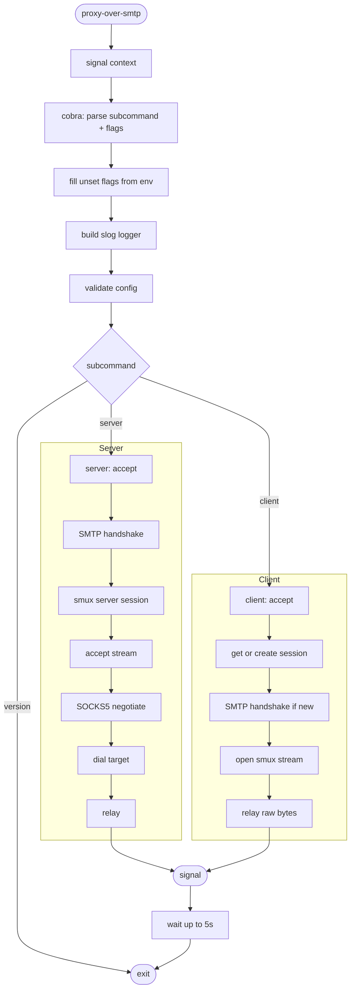
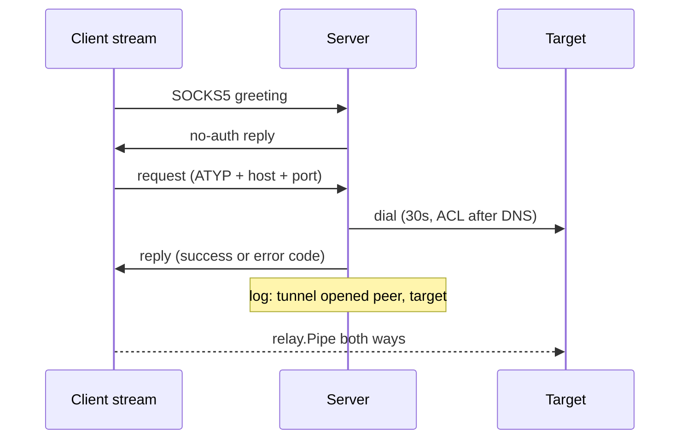

# Proxy-Over-SMTP — Workflows

Step-by-step data flow: startup → handshake → tunnel → shutdown.

---

## Pipeline Overview

---

## Stage Details

### 1. Startup (`cmd/proxy-over-smtp/main.go`)

1. `signal.NotifyContext` for `SIGINT` / `SIGTERM`, then `cli.Execute(ctx, BuildInfo)`.
2. Cobra parses the subcommand (`server`, `client`, `version`) and flags.
3. `PersistentPreRunE`: flags not set on the command line are filled from `PROXY_OVER_SMTP_*` env (flag > env > default). Then build the `slog` logger (`--log-level`, `--log-format`, optional `--log-file` tee).
4. `RunE`: `Config.Validate()` (secret required), `tunnel.New(cfg, logger)`, then `RunServer(ctx)` or `RunClient(ctx)`.
5. After the run returns: drain, then `PersistentPostRunE` closes the log file. Any error exits with code 1.

### 2. Server (`internal/tunnel/server.go`)

1. Listen on `--listen`. `context.AfterFunc` closes the listener on context cancel.
2. Per accepted connection (tracked in `conns`): 30s deadline, SMTP handshake with exact secret match (see [ARCHITECTURE.md](ARCHITECTURE.md#2-handshake-fake-smtp)).
3. Clear the deadline, wrap in `xorstream.New(rw, secret)`, start `smux.Server`.
4. Loop on `sess.AcceptStream()`. Per stream, in its own tracked goroutine with a 30s deadline until the reply is sent:

### 3. Client (`internal/tunnel/client.go`)

1. Listen on `--listen`. `context.AfterFunc` closes the listener on context cancel.
2. Per accepted local connection (tracked in `conns`): `getSession`.
3. `getSession` under `sessMu`: reuse `Tunnel.sess` if open. Otherwise dial `--remote` (30s, cancelled by shutdown), run the client handshake, wrap in XOR, `smux.Client`.
4. Open a stream (on failure drop the session and retry once on a fresh one) and `relay.Pipe(local, stream)`. The browser's SOCKS5 bytes travel unchanged to the server.

### 4. Graceful Shutdown

1. Signal cancels the context. Listeners, open connections and the client session close.
2. The CLI waits on `Tunnel.Wait()` in a goroutine, racing a 5s timer.
3. Logs `shutdown complete`, or `shutdown timed out, forcing exit` (warn).

---

## File Naming Conventions

| File | Location | Pattern |
|---|---|---|
| Binary | project root (`make build`) | `proxy-over-smtp` |
| Log file (optional) | `--log-file`, off by default | user-chosen |
| Docker binary | image | `/usr/app/proxy-over-smtp/proxy-over-smtp` |
| Release archive | `dist/` (GoReleaser) | zip per OS/arch |

---

## Error Recovery

| Scenario | Recovery |
|---|---|
| Handshake fails or times out (30s) | Connection closed, no reply. Logged at debug (`handshake rejected`) |
| Wrong secret in `EHLO` | Connection closed, no reply. Debug log `handshake rejected` |
| Client cannot dial server or handshake fails | Log `open stream failed` (warn) with `err`, local connection closed. Next local connection retries |
| smux session closed or keepalive times out (60s) | Next local connection creates a new session |
| Stream open fails on a stale session | Session dropped, one retry on a fresh session |
| SOCKS version is not 5, no no-auth method, empty domain | Stream closed (`0xFF` reply for no method). Debug log `socks request rejected` |
| Command is not CONNECT | Reply `0x07`, stream closed |
| Unsupported address type | Reply `0x08`, stream closed |
| SOCKS negotiation stalls (30s) | Stream closed |
| Target blocked by ACL | Warn `target unreachable` with `target`, `err`. Reply `0x02` |
| Target dial fails | Warn `target unreachable` with `target`, `err`. Reply `0x05` refused / `0x03` network / `0x04` host / `0x01` other |
| Accept fails | Warn `accept failed`, retry with backoff up to 1s |
| Listen fails | Cobra prints the error, exit 1 |
| `--log-file` cannot be opened | Exit 1 |
| Secret missing, bad env value (e.g. `PROXY_OVER_SMTP_ALLOW_PRIVATE=x`), bad `--log-level` / `--log-format` | Exit 1 at startup |
| Old-style flag (`-secret`, `-mode`) | Exit 1, unknown shorthand flag |
| Shutdown exceeds 5s | Logs timeout line and exits |
