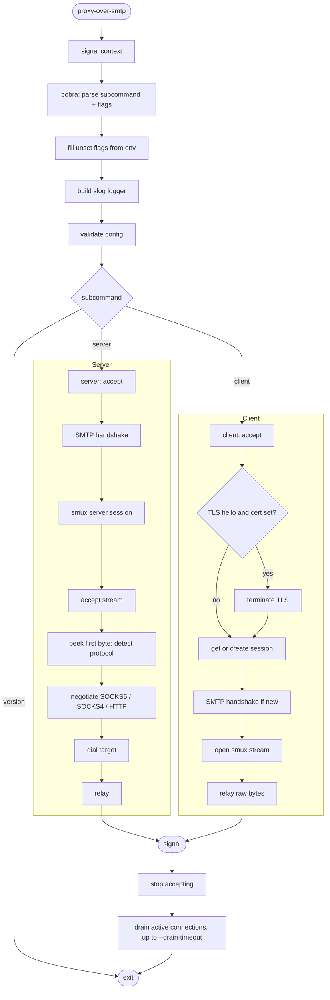
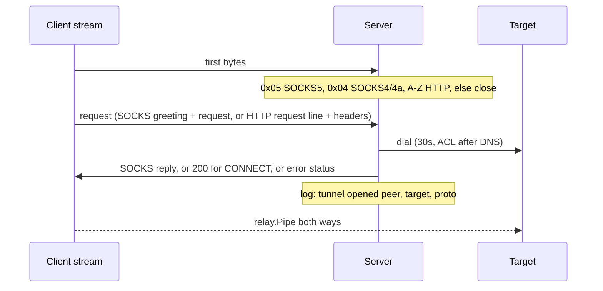
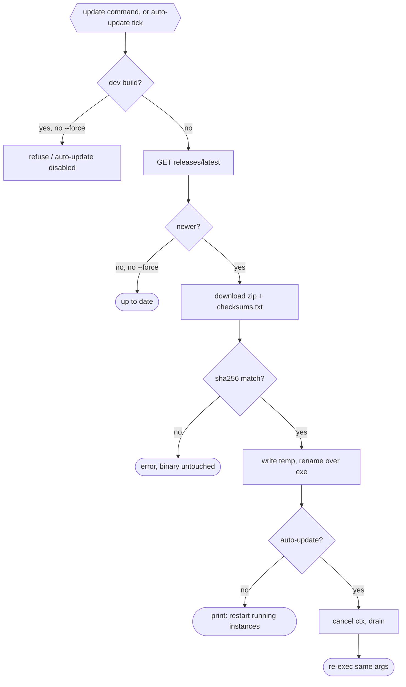
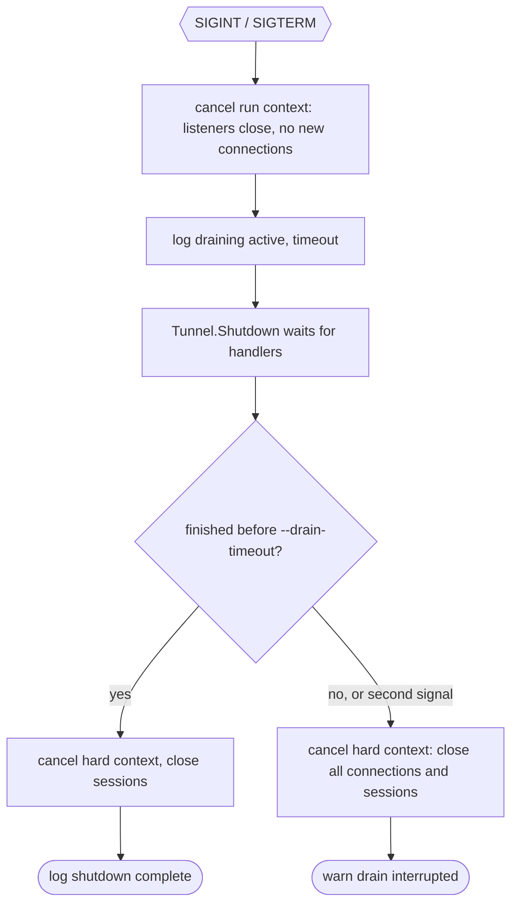

# Proxy-Over-SMTP — Workflows

Step-by-step data flow: startup → handshake → tunnel → shutdown.

---

## Pipeline Overview

---

## Stage Details

### 1. Startup (`cmd/proxy-over-smtp/main.go`)

1. `signal.NotifyContext` for `SIGINT` / `SIGTERM`, then `cli.Execute(ctx, BuildInfo)`.
2. Cobra parses the subcommand (`server`, `client`, `version`, `update`) and flags.
3. `PersistentPreRunE`: flags not set on the command line are filled from `PROXY_OVER_SMTP_*` env (flag > env > default). Then build the `slog` logger (`--log-level`, `--log-format`, optional `--log-file` tee).
4. `RunE`: `Config.Validate()` (secret required, TLS cert and key together, non-negative `--drain-timeout`), `tunnel.New(cfg, logger)` (loads the TLS key pair, can fail), then `RunServer(ctx)` or `RunClient(ctx)`.
5. After the accept loop returns: drain (stage 5), then `PersistentPostRunE` closes the log file. Any error exits with code 1.
6. If auto-update installed a release, `Execute` returns `restart=true`. `main` then calls `update.Restart()`.

### 2. Server (`internal/tunnel/server.go`)

1. Listen on `--listen`. `context.AfterFunc` closes the listener when the run context is cancelled (stop accepting only).
2. Per accepted connection (tracked in `conns`): 30s deadline, SMTP handshake with exact secret match (see [ARCHITECTURE.md](ARCHITECTURE.md#2-handshake-fake-smtp)).
3. Clear the deadline, wrap in `xorstream.New(rw, secret)`, start `smux.Server`.
4. Loop on `sess.AcceptStream()`. Once draining starts, new streams are closed at once and the session closes when its last stream ends. Per stream, in its own tracked goroutine with a 30s deadline until the reply is sent:

For plain HTTP (absolute-form) there is no `200`: the server rewrites the request to origin-form (hop-by-hop headers stripped, `Connection: close`), writes it to the target, then relays the response. Request bytes after the header that were already buffered are relayed too.

### 3. Client (`internal/tunnel/client.go`)

1. Listen on `--listen`. `context.AfterFunc` closes the listener when the run context is cancelled (stop accepting only).
2. Per accepted local connection (tracked in `conns`): 30s deadline, peek the first byte. If it is `0x16` and `--tls-cert`/`--tls-key` are set, terminate TLS (handshake bound by the same deadline). If it is `0x16` without a certificate, close with debug log `tls not enabled`. Then `getSession`.
3. `getSession` under `sessMu`: reuse `Tunnel.sess` if open. Otherwise dial `--remote` (30s, cancelled by shutdown), run the client handshake, wrap in XOR, `smux.Client`.
4. Open a stream (on failure drop the session and retry once on a fresh one) and `relay.Pipe(local, stream)`. The application's proxy bytes (decrypted when TLS was terminated) travel unchanged to the server.

### 4. Update (`internal/update/`, `internal/cli/update.go`)

`auto-update` checks at start, then every `--update-interval`. Failures log a warn and keep the old binary running.

### 5. Graceful Shutdown

1. The signal cancels the run context. `RunServer` / `RunClient` stop accepting and return. In-flight connections keep running.
2. The CLI logs `draining` (`active`, `timeout`) and calls `Tunnel.Shutdown` with a context limited by `--drain-timeout`. A second `SIGINT` / `SIGTERM` cancels that context and forces the end.
3. Server sessions refuse new streams and close once idle. The client keeps its shared session for in-flight relays and closes it after the drain.
4. Clean drain: `shutdown complete`. Forced: warn `drain interrupted, connections closed`, then up to 5s for handler goroutines to exit.

Auto-update runs the same drain before it re-executes.

---

## File Naming Conventions

| File | Location | Pattern |
|---|---|---|
| Binary | project root (`make build`) | `proxy-over-smtp` |
| Log file (optional) | `--log-file`, off by default | user-chosen |
| Docker binary | image | `/usr/app/proxy-over-smtp/proxy-over-smtp` |
| Release archive | `dist/` (GoReleaser) | zip per OS/arch |

---

## Error Recovery

| Scenario | Recovery |
|---|---|
| Handshake fails or times out (30s) | Connection closed, no reply. Logged at debug (`handshake rejected`) |
| Wrong secret in `EHLO` | Connection closed, no reply. Debug log `handshake rejected` |
| Client cannot dial server or handshake fails | Log `open stream failed` (warn) with `err`, local connection closed. Next local connection retries |
| smux session closed or keepalive times out (60s) | Next local connection creates a new session |
| Stream open fails on a stale session | Session dropped, one retry on a fresh session |
| First byte is not `0x05`, `0x04` or `A`-`Z` | Stream closed. Debug log `proxy request rejected` |
| SOCKS5 version is not 5, no no-auth method, empty domain | Stream closed (`0xFF` reply for no method). Debug log `proxy request rejected` |
| SOCKS4 command is not CONNECT, or user ID / domain over 255 bytes | Reply `0x5B`, stream closed |
| HTTP request is origin-form, non-http scheme, or malformed | Reply `400`, stream closed |
| TLS hello at the client without `--tls-cert` | Local connection closed. Debug log `tls not enabled` |
| TLS handshake fails or stalls (30s) at the client | Local connection closed. Debug log |
| Command is not CONNECT | Reply `0x07`, stream closed |
| Unsupported address type | Reply `0x08`, stream closed |
| SOCKS negotiation stalls (30s) | Stream closed |
| Target blocked by ACL | Warn `target unreachable` with `target`, `err`. SOCKS5 `0x02`, SOCKS4 `0x5B`, HTTP `403` |
| Target dial fails | Warn `target unreachable` with `target`, `err`. SOCKS5 `0x05` refused / `0x03` network / `0x04` host / `0x01` other. SOCKS4 `0x5B`. HTTP `504` on timeout, else `502` |
| Accept fails | Warn `accept failed`, retry with backoff up to 1s |
| Listen fails | Cobra prints the error, exit 1 |
| `--log-file` cannot be opened | Exit 1 |
| Secret missing, bad env value (e.g. `PROXY_OVER_SMTP_ALLOW_PRIVATE=x`), bad `--log-level` / `--log-format` | Exit 1 at startup |
| Old-style flag (`-secret`, `-mode`) | Exit 1, unknown shorthand flag |
| Drain exceeds `--drain-timeout`, or a second signal arrives | Warn `drain interrupted, connections closed`, remaining connections cut, process exits |
| Negative `--drain-timeout`, `--tls-cert` without `--tls-key`, unreadable key pair | Exit 1 at startup |
| Update check fails (network, GitHub rate limit 403/429) | `update` exits 1. Auto-update warns `update check failed` and retries next interval |
| Checksum mismatch or missing asset for this platform | Error, binary untouched. Auto-update warns `update failed` |
| Binary location not writable | Error with permission hint, binary untouched |
| Re-exec fails after a successful swap | `restart:` on stderr, exit 1. New binary is on disk: start it manually |
| `--update-interval` below 1h | Exit 1 at startup |
