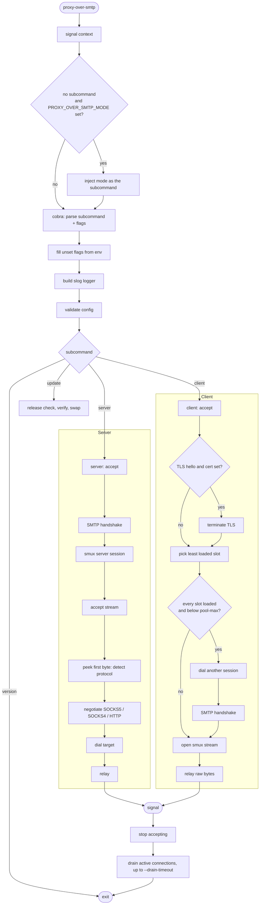
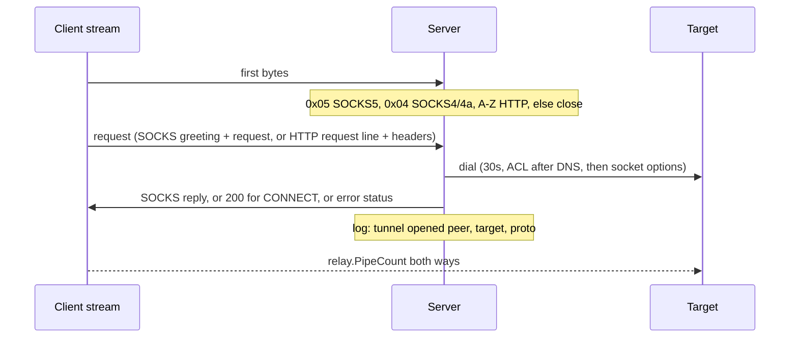
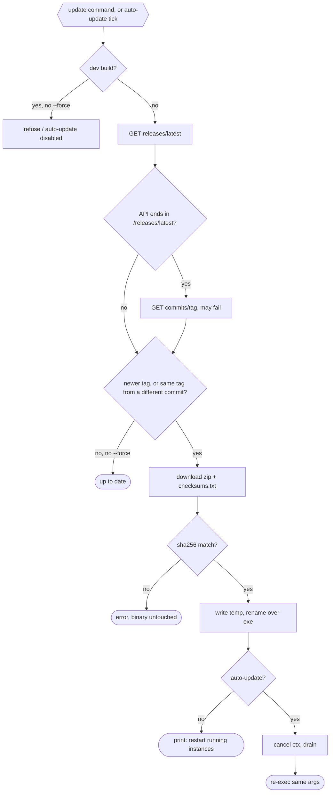

# Proxy-Over-SMTP — Workflows

Step-by-step data flow: startup → handshake → tunnel → shutdown.

---

## Pipeline Overview

---

## Stage Details

### 1. Startup (`cmd/proxy-over-smtp/main.go`)

1. `signal.NotifyContext` for `SIGINT` / `SIGTERM`, then `cli.Execute(ctx, BuildInfo)`.
2. Mode resolution runs before cobra: when the command line names no subcommand and `PROXY_OVER_SMTP_MODE` is set to `server` or `client`, that mode is inserted as the subcommand. A subcommand the user typed always wins, `--help` / `--version` / `help` are left alone, and any other value exits 1.
3. Cobra parses the subcommand (`server`, `client`, `version`, `update`) and flags.
4. `PersistentPreRunE`: flags not set on the command line are filled from `PROXY_OVER_SMTP_*` env (flag > env > default). Then build the `slog` logger (`--log-level`, `--log-format`, optional `--log-file` tee).
5. `RunE`: `Config.Validate()` (secret required, one of the two ciphers, `--max-streams` above zero, `--listen` and `--remote` in `host:port` shape, TLS cert and key together, non-negative `--drain-timeout`), `tunnel.New(cfg, logger)` (loads the TLS key pair, can fail), then `RunServer(ctx)` or `RunClient(ctx)`.
6. After the accept loop returns: drain (stage 5), then `PersistentPostRunE` closes the log file. Any error exits with code 1.
7. If auto-update installed a release, `Execute` returns `restart=true`. `main` then calls `update.Restart()`.

### 2. Server (`internal/tunnel/server.go`)

1. Listen on `--listen` through the tuned listener (`t.listen`: buffers, reuse, keepalive, see [ARCHITECTURE.md](ARCHITECTURE.md#5-socket-options)). `context.AfterFunc` closes the listener when the run context is cancelled (stop accepting only).
2. Per accepted connection (tracked in `conns`): 30s deadline, challenge-response SMTP handshake that proves the secret with an HMAC (see [ARCHITECTURE.md](ARCHITECTURE.md#2-handshake-fake-smtp-challenge-response)). Every handshake line is capped at 4KB, so an oversized `EHLO` is rejected instead of buffered.
3. Clear the deadline, wrap in the `--cipher` stream (`xorstream.New(rw, secret)` or `aesstream.New(rw, s2c, c2s)`), start `smux.Server`.
4. Loop on `sess.AcceptStream()`. Once draining starts, new streams are closed at once and the session closes when its last stream ends. Streams beyond `--max-streams` are also closed at once, so a peer cannot hold unbounded handlers. Per stream, in its own tracked goroutine with a 30s deadline until the reply is sent:

The server has no closing audit line: its `tunnel opened` names the destination, and the client's `connection closed` carries the byte totals.

For plain HTTP (absolute-form) there is no `200`: the server rewrites the request to origin-form (hop-by-hop headers stripped, `Connection: close`), writes it to the target, then relays the response. Request bytes after the header that were already buffered are relayed too.

### 3. Client (`internal/tunnel/client.go`, `internal/tunnel/pool.go`)

1. Listen on `--listen` through the same tuned listener. `context.AfterFunc` closes the listener when the run context is cancelled (stop accepting only).
2. Per accepted local connection (tracked in `conns`): 30s deadline, peek the first byte. If it is `0x16` and `--tls-cert`/`--tls-key` are set, terminate TLS (handshake bound by the same deadline). If it is `0x16` without a certificate, close with debug log `tls not enabled`. Then `pickSlot`.
3. `pickSlot` reserves a stream on the healthy slot carrying the fewest streams. When every slot is loaded (`max(4, max-streams/8)` streams each) and the pool is below `--pool-max`, it dials another: `--remote` (30s, tuned dialer, cancelled by shutdown), client handshake, `--cipher` stream wrap, `smux.Client`. Growth is single-flight per slot, so concurrent local connections wait for the dial in progress and then take the least loaded slot. Closed slots are dropped on every pick; a stream open that fails removes its slot and retries on another.
4. `relay.PipeCount(local, stream)`. The application's proxy bytes (decrypted when TLS was terminated) travel unchanged to the server. When the relay ends, one line is logged: `connection closed` with `peer` (the local application), `up`, `down` and `dur`. The client never parses the request, so no target appears in any client line.
5. Closing that stream releases its slot reservation. If the slot is now empty it records the time, and the shrink scan that runs on every stream close drops any slot idle for 60s, down to `--pool-min`.

### 4. Update (`internal/update/`, `internal/cli/update.go`)

The commit lookup is best effort: a failure there leaves the commit unknown and the check falls back to the tag comparison, rather than failing the update. `--check` prints both labels (`current vX~c, latest vY~s`) before anything is replaced.

`auto-update` checks at start, then every `--update-interval`. Failures log a warn and keep the old binary running.

### 5. Graceful Shutdown

1. The signal cancels the run context. `RunServer` / `RunClient` stop accepting and return. In-flight connections keep running.
2. The CLI logs `draining` (`active`, `timeout`) and calls `Tunnel.Shutdown` with a context limited by `--drain-timeout`. A second `SIGINT` / `SIGTERM` cancels that context and forces the end.
3. Server sessions refuse new streams and close once idle. The client keeps its pooled sessions for in-flight relays and closes them after the drain.
4. Clean drain: `shutdown complete`. Forced: warn `drain interrupted, connections closed`, then up to 5s for handler goroutines to exit.

Auto-update runs the same drain before it re-executes.

---

## Verifying Throughput

Run these by hand. Nothing here is a CI gate: shared runners are too noisy to assert a rate on, and the ordinary tests are what catch a regression in the copy path.

| Step | Command | Expect |
|---|---|---|
| Per-layer numbers | `make bench` (or `make bench-short`) | Relay near memory speed, AES seal above 2 GB/s, XOR seal above 400 MB/s, `BenchmarkProxyThroughput` per cipher, stream count and pooled case |
| Direct baseline | `curl -o /dev/null --limit-rate 100M http://host/file` | Transfer finishes at the cap, so the link is the limit |
| Through the proxy | Same URL with `-x socks5h://127.0.0.1:1080` | Within 80% of the direct run at caps up to 100M. Measured on loopback: 99% (`aes`), 100% (`xor`) |
| Single long-fat stream | One `iperf3 -c host` through the client | Underruns on a high-RTT link: that is the `window / RTT` ceiling, not a fault |
| Multi-stream | Several transfers at once, or `iperf3 -P 8` | Aggregate approaches line rate; streams needed per RTT in [Architecture](ARCHITECTURE.md#throughput) |
| Pool grows | Run the client with `--log-level debug` and drive concurrent transfers, then check the server's connection count | One TCP connection per client until a slot is loaded, then another, up to `--pool-max`. Debug log `session pool shrunk` when it drops back |
| Pool aggregate | N parallel capped transfers, direct versus through the client | Proxied total rises with the number of sessions and passes what one session alone could carry |
| Bad pool bounds | `--pool-min 9 --pool-max 8`, or `--pool-max 99` | Exit 1 at startup: `pool-min must not exceed pool-max`, `pool sizes must be between 1 and 16` |

Cipher stays `--cipher aes` for these: both ciphers measure the same end to end at the CPU ceiling, and AES is the default.

---

## File Naming Conventions

| File | Location | Pattern |
|---|---|---|
| Binary | project root (`make build`) | `proxy-over-smtp` |
| Log file (optional) | `--log-file`, off by default | user-chosen |
| Docker binary | image | `/usr/app/proxy-over-smtp/proxy-over-smtp` |
| Release archive | `dist/` (GoReleaser) | zip per OS/arch |

---

## Error Recovery

| Scenario | Recovery |
|---|---|
| Handshake fails or times out (30s) | Connection closed, no reply. Logged at debug (`handshake rejected`) |
| Wrong proof or malformed nonce | Connection closed, no reply. Debug log `handshake rejected` |
| Handshake line over 4KB, or over 16 `250-` replies | Connection closed, no reply. Debug log `handshake rejected` |
| Cipher differs between ends | Handshake succeeds, then the first AES record fails to open: slot evicted, next local connection re-dials |
| AES record fails authentication (wrong key, tampered data, lost position) | Stream error, slot evicted. Warn `open stream failed` on the client |
| Client cannot dial server or handshake fails | Log `open stream failed` (warn) with `err`, local connection closed. An existing slot still takes the stream; otherwise the next local connection retries |
| smux session closed or keepalive times out (60s) | The slot is dropped on the next pick, and a new session is dialed |
| Stream open fails on a stale session | That slot is evicted and the open retries on another, up to one attempt per possible slot |
| First byte is not `0x05`, `0x04` or `A`-`Z` | Stream closed. Debug log `proxy request rejected` |
| Stream beyond `--max-streams` (default 128) on a session | Stream closed at once. Debug log `stream refused` |
| `RunServer`/`RunClient` after `Shutdown` | Returns `tunnel is shut down`, no listener started. `Shutdown` before any Run returns nil |
| SOCKS5 version is not 5, no no-auth method, empty domain | Stream closed (`0xFF` reply for no method). Debug log `proxy request rejected` |
| SOCKS5 request truncated mid-field | `0x01` general failure reply, stream closed. Debug log `proxy request rejected` |
| SOCKS4 command is not CONNECT, or user ID / domain over 255 bytes | Reply `0x5B`, stream closed |
| HTTP request is origin-form, non-http scheme, or malformed | Reply `400`, stream closed |
| TLS hello at the client without `--tls-cert` | Local connection closed. Debug log `tls not enabled` |
| TLS handshake fails or stalls (30s) at the client | Local connection closed. Debug log |
| Command is not CONNECT | Reply `0x07`, stream closed |
| Unsupported address type | Reply `0x08`, stream closed |
| SOCKS negotiation stalls (30s) | Stream closed |
| Target blocked by ACL | Warn `target unreachable` with `target`, `err`. SOCKS5 `0x02`, SOCKS4 `0x5B`, HTTP `403` |
| Target dial fails | Warn `target unreachable` with `target`, `err`. SOCKS5 `0x05` refused / `0x03` network / `0x04` host / `0x01` other. SOCKS4 `0x5B`. HTTP `504` on timeout, else `502` |
| Accept fails | Warn `accept failed`, retry with backoff up to 1s |
| Listen fails, including a failed `setsockopt` on the listener | Cobra prints the error, exit 1 |
| `setsockopt` fails on a dial | Dial fails like any dial error: client `open stream failed`, server `target unreachable` |
| `--log-file` cannot be opened | Exit 1 |
| Secret missing, bad env value (e.g. `PROXY_OVER_SMTP_ALLOW_PRIVATE=x`), bad `--log-level` / `--log-format` | Exit 1 at startup |
| Malformed `--listen` / `--remote` (no port, too many colons) | Exit 1 at startup, before any bind |
| Old-style flag (`-secret`, `-mode`) | Exit 1, unknown shorthand flag |
| Drain exceeds `--drain-timeout`, or a second signal arrives | Warn `drain interrupted, connections closed`, remaining connections cut, process exits |
| Negative `--drain-timeout`, `--tls-cert` without `--tls-key`, unreadable key pair | Exit 1 at startup |
| Update check fails (network, GitHub rate limit 403/429) | `update` exits 1. Auto-update warns `update check failed` and retries next interval |
| Commit lookup for the release tag fails (404, network, malformed JSON) | Not an error: the commit stays unknown, the check continues on the tag alone |
| Same tag, different commit | Treated as an update: manual `update` reinstalls, auto-update swaps and restarts |
| Same tag, either commit unknown or running build dirty | Not an update. Avoids reinstalling the same binary on every interval |
| Checksum mismatch or missing asset for this platform | Error, binary untouched. Auto-update warns `update failed` |
| Stale `<exe>.old` from a previous Windows update | Removed and the rename retried once, so the update still succeeds |
| Binary location not writable | Error with permission hint, binary untouched |
| Re-exec fails after a successful swap | `restart:` on stderr, exit 1. New binary is on disk: start it manually |
| `--update-interval` below 1h | Exit 1 at startup |
