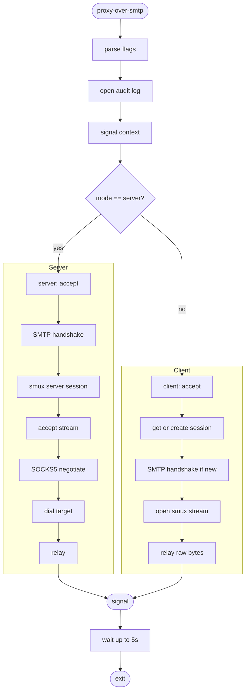
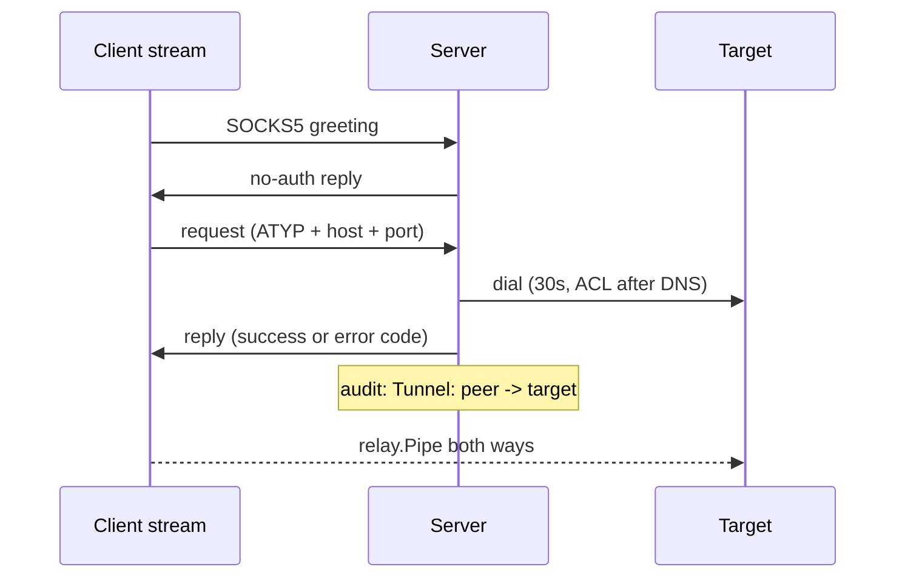

# Proxy-Over-SMTP — Workflows

Step-by-step data flow: startup → handshake → tunnel → shutdown.

---

## Pipeline Overview

---

## Stage Details

### 1. Startup (`cmd/proxy-over-smtp/main.go`)

1. `config.Parse()` — read the flags, then `Validate()` (mode, non-empty secret). Failure exits.
2. Open `-log-file` (append, create, fatal on error) and build the `AUDIT: ` logger writing to stdout + file. Warn when the secret is the default.
3. `signal.NotifyContext` for `SIGINT` / `SIGTERM`.
4. `tunnel.New(cfg, logger)`, then `RunServer(ctx)` when `-mode server`, otherwise `RunClient(ctx)`.

### 2. Server (`internal/tunnel/server.go`)

1. Listen on `-server`. A goroutine closes the listener on context cancel.
2. Per accepted connection (tracked in `conns`): 30s deadline, SMTP handshake with exact secret match (see [ARCHITECTURE.md](ARCHITECTURE.md#2-handshake-fake-smtp)).
3. Clear the deadline, wrap in `xorstream.New(rw, secret)`, start `smux.Server`.
4. Loop on `sess.AcceptStream()`. Per stream, in its own tracked goroutine with a 30s deadline until the reply is sent:

### 3. Client (`internal/tunnel/client.go`)

1. Listen on `-client`. A goroutine closes the listener on context cancel.
2. Per accepted local connection (tracked in `conns`): `getSession`.
3. `getSession` under `sessMu`: reuse `Tunnel.sess` if open. Otherwise dial `-remote` (30s, cancelled by shutdown), run the client handshake, wrap in XOR, `smux.Client`.
4. Open a stream (on failure drop the session and retry once on a fresh one) and `relay.Pipe(local, stream)`. The browser's SOCKS5 bytes travel unchanged to the server.

### 4. Graceful Shutdown

1. Signal cancels the context. Listeners, open connections and the client session close.
2. `main` waits on `Tunnel.Wait()` in a goroutine, racing a 5s timer.
3. Logs `Shutdown Complete`, or `Shutdown Timed-Out. Forcing Exit`.

---

## File Naming Conventions

| File | Location | Pattern |
|---|---|---|
| Binary | project root (`make build`) | `proxy-over-smtp` |
| Audit log | `-log-file` (default CWD) | `proxy-over-smtp.log` |
| Docker binary | image | `/usr/app/proxy-over-smtp/proxy-over-smtp` |
| Release archive | `dist/` (GoReleaser) | zip per OS/arch |

---

## Error Recovery

| Scenario | Recovery |
|---|---|
| Handshake fails or times out (30s) | Connection closed, no reply, nothing logged |
| Wrong secret in `EHLO` | Connection closed, no reply |
| Client cannot dial server or handshake fails | Audit `Session Failed: <err>`, local connection closed. Next local connection retries |
| smux session closed or keepalive times out (60s) | Next local connection creates a new session |
| Stream open fails on a stale session | Session dropped, one retry on a fresh session |
| SOCKS version is not 5, no no-auth method, empty domain | Stream closed (`0xFF` reply for no method) |
| Command is not CONNECT | Reply `0x07`, stream closed |
| Unsupported address type | Reply `0x08`, stream closed |
| SOCKS negotiation stalls (30s) | Stream closed |
| Target blocked by ACL | Audit `Failed to Reach <target>: ...`, reply `0x02` |
| Target dial fails | Audit `Failed to Reach <target>: <err>`, reply `0x05` refused / `0x03` network / `0x04` host / `0x01` other |
| Accept fails | Audit `Accept Failed`, retry with backoff up to 1s |
| Listen fails | `main` logs the error and exits |
| `-log-file` cannot be opened | `main` exits |
| `-mode` invalid or `-secret` empty | `main` exits at startup |
| Shutdown exceeds 5s | Logs timeout line and exits |
